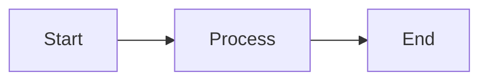
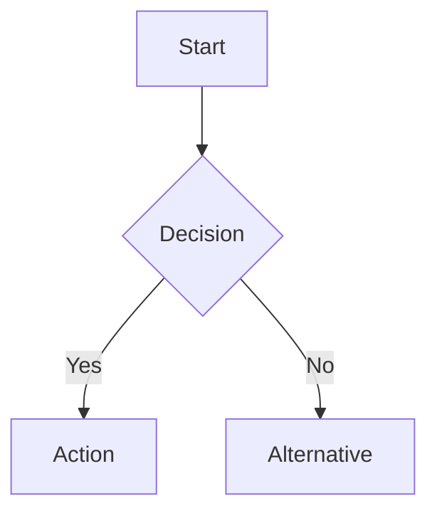

# Blog Architecture Documentation

## Overview

The blog system has been re-architected to follow a config-driven approach similar to the web tools system. This provides better maintainability, type safety, and SEO capabilities.

## Architecture Components

### 1. Type System (`src/types/blog-config.ts`)

Defines the core types for blog posts:

- **BlogIds**: Enum of all blog post identifiers
- **BlogCategory**: Enum of blog categories (Web Development, Security, Tools, etc.)
- **BlogAuthor**: Author information interface
- **BlogConfig**: Complete configuration for a blog post including:
  - Metadata (title, description, SEO tags)
  - Content file reference (markdown)
  - Category and tags
  - Author information
  - Publishing dates
  - Reading time
  - Featured status
  - Related posts
- **BlogNavigationConfig**: Simplified config for listing pages

### 2. Blog Configuration Files (`src/data/blog/config/`)

Each blog post has a TypeScript configuration file that exports:

```typescript
export const blogConfig: BlogConfig = {
  blogId: BlogIds.YOUR_BLOG_ID,
  title: "Your Blog Title",
  slug: "your-blog-slug",
  excerpt: "Brief description for listing pages",
  category: BlogCategory.YOUR_CATEGORY,
  tags: ["tag1", "tag2", "tag3"],
  author: {
    name: "Author Name",
    gender: "M" | "F" | "O",
  },
  publishedAt: "2025-01-01T00:00:00.000Z",
  updatedAt: "2025-01-01T00:00:00.000Z",
  readingTimeMinutes: 8,
  isFeatured: true,
  isDisabled: false,
  relatedPosts: [BlogIds.RELATED_POST_1],
  contentFile: "your-blog-slug.md",
  metadata: {
    // Next.js Metadata object with SEO tags
  },
};
```

### 3. Markdown Content Files (`src/data/blog/content/`)

Blog content is written in Markdown with support for:

- Standard Markdown syntax
- GitHub Flavored Markdown (GFM)
- Mermaid diagrams for flowcharts and visualizations
- Code syntax highlighting
- Tables, lists, blockquotes
- Internal and external links

Example markdown with mermaid:

````markdown
# Your Blog Title

Your introduction paragraph...

## Section with Diagram


````

````

### 4. Blog Posts Registry (`src/data/blogPosts.ts`)

Central registry that exports:

- **blogPosts**: Record of all blog posts by BlogId
- **getAllBlogPosts()**: Returns array of all posts
- **getFeaturedBlogPosts()**: Returns only featured posts
- **getBlogPostsByCategory()**: Filter by category
- **sortBlogPostsByDate()**: Sort posts by date

### 5. Markdown Renderer (`src/components/MarkdownRenderer.tsx`)

Client-side component that renders markdown with:

- Material-UI styled components
- Syntax highlighting for code blocks
- Mermaid diagram rendering
- Responsive tables
- Styled links, lists, and blockquotes

### 6. Blog Pages

#### Blog Listing Page (`src/app/blog/page.tsx`)

- Displays all blog posts in a grid layout
- Separates featured posts from regular posts
- Shows excerpts, categories, reading time
- Includes social sharing
- SEO optimized with structured data

#### Blog Detail Page (`src/app/blog/[pageUrl]/page.tsx`)

- Renders individual blog post
- Displays category chips and reading time
- Shows author and publication date
- Renders markdown content with mermaid support
- Tag list for SEO
- Social sharing at top and bottom
- Structured data for articles

## Adding a New Blog Post

### Step 1: Add Blog ID to Enum

Edit `src/types/blog-config.ts`:

```typescript
export enum BlogIds {
  DECODING_JWT_COMPREHENSIVE_GUIDE = "decoding-jwt-comprehensive-guide",
  YOUR_NEW_POST = "your-new-post", // Add this
}
````

### Step 2: Create Blog Configuration

Create `src/data/blog/config/your-new-post.ts`:

```typescript
import { BlogConfig, BlogIds, BlogCategory } from "@/types/blog-config";
import { Metadata } from "next";

const navigationUrl = "/blog/your-new-post";
const pageTitle = "Your Blog Post Title";
const pageDescription = "Brief description under 160 characters";
const imageUrl = `${process.env.SCREENSHOTS_BASE_URL}/blog/your-new-post.png`;
const keywords = ["keyword1", "keyword2", "keyword3"];

export const metadata: Metadata = {
  // ... SEO metadata configuration
};

export const blogConfig: BlogConfig = {
  blogId: BlogIds.YOUR_NEW_POST,
  title: "Your Blog Post Title",
  slug: "your-new-post",
  excerpt: "Longer excerpt for blog listing cards (2-3 sentences)",
  category: BlogCategory.WEB_DEVELOPMENT,
  tags: keywords,
  author: {
    name: "Your Name",
    gender: "M",
  },
  publishedAt: new Date().toISOString(),
  updatedAt: new Date().toISOString(),
  readingTimeMinutes: 5,
  isFeatured: false,
  isDisabled: false,
  relatedPosts: [],
  contentFile: "your-new-post.md",
  metadata,
};
```

### Step 3: Write Markdown Content

Create `src/data/blog/content/your-new-post.md`:

````markdown
# Your Blog Post Title

Introduction paragraph...

## Section Heading

Content with **bold**, _italic_, and [links](https://example.com).

### Code Example

```javascript
const example = "syntax highlighting works";
console.log(example);
```
````

### Mermaid Diagram



## Conclusion

Final thoughts...

````

### Step 4: Register in Blog Posts

Edit `src/data/blogPosts.ts`:

```typescript
import { blogConfig as yourNewPost } from "./blog/config/your-new-post";

export const blogPosts: Record<BlogIds, BlogNavigationConfig> = {
  [BlogIds.DECODING_JWT_COMPREHENSIVE_GUIDE]: { /* ... */ },
  [BlogIds.YOUR_NEW_POST]: {
    blogId: yourNewPost.blogId,
    title: yourNewPost.title,
    slug: yourNewPost.slug,
    category: yourNewPost.category,
    excerpt: yourNewPost.excerpt,
    publishedAt: yourNewPost.publishedAt,
    updatedAt: yourNewPost.updatedAt,
    author: yourNewPost.author,
    readingTimeMinutes: yourNewPost.readingTimeMinutes,
    isFeatured: yourNewPost.isFeatured,
  },
};
````

### Step 5: Import Config in Blog Detail Page

Edit `src/app/blog/[pageUrl]/page.tsx`:

```typescript
import { blogConfig as yourNewPost } from "@/data/blog/config/your-new-post";

const blogConfigs = {
  [BlogIds.DECODING_JWT_COMPREHENSIVE_GUIDE]: decodingJwtGuide,
  [BlogIds.YOUR_NEW_POST]: yourNewPost, // Add this
};
```

### Step 6: Generate Screenshot (Optional)

For social media previews, add a screenshot at:
`public/screenshots/blog/your-new-post.png` (1200x630px)

## Benefits of New Architecture

1. **Type Safety**: TypeScript ensures all configs are complete and correct
2. **Maintainability**: Each blog post is self-contained in config + markdown
3. **SEO Optimized**: Full control over metadata, structured data, social tags
4. **Developer Experience**: Write content in markdown, not HTML
5. **Rich Content**: Mermaid diagrams, syntax highlighting, GFM features
6. **Consistency**: Same patterns as web tools system
7. **Performance**: Static generation with Next.js App Router
8. **Scalability**: Easy to add categories, tags, filters, search

## Migration Notes

### Removed Components

- `editBlogEntity.tsx` - No longer needed (edit markdown files directly)
- `addBlogPageForm.tsx` - Replaced by config-driven approach

### Deprecated Files

- `src/data/blogList.json` - Replaced by `blogPosts.ts`
- `src/data/blog/*.json` - Replaced by config + markdown files

### Updated Types

- `BlogEntity` (old) → `BlogConfig` (new)
- `BlogEntityOverview` (old) → `BlogNavigationConfig` (new)

## Future Enhancements

Potential additions to consider:

1. **Blog Categories Page**: `/blog/category/[category]`
2. **Blog Tags Page**: `/blog/tag/[tag]`
3. **Blog Search**: Full-text search functionality
4. **RSS Feed**: Auto-generate from blog configs
5. **Related Posts**: Algorithm based on tags/category
6. **Table of Contents**: Auto-generated from markdown headings
7. **Estimated Read Progress**: Reading progress bar
8. **Comments**: Integration with commenting system
9. **Author Pages**: Multi-author support
10. **Blog Analytics**: Track popular posts

## Dependencies

- `react-markdown`: Markdown parsing and rendering
- `remark-gfm`: GitHub Flavored Markdown support
- `rehype-highlight`: Code syntax highlighting
- `rehype-raw`: Allow raw HTML in markdown
- `mermaid`: Diagram and flowchart rendering
- `highlight.js`: Syntax highlighting themes
