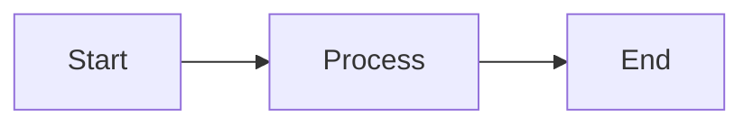

# Blog Re-architecture Summary

## What Was Done

Successfully re-architected the entire blog system to match the config-driven approach used by web tools, with the following major changes:

### 1. New Type System ✅

- Created `src/types/blog-config.ts` with comprehensive TypeScript types
- Defined `BlogIds`, `BlogCategory`, `BlogConfig`, `BlogNavigationConfig`, and `BlogAuthor` interfaces
- Added enum-based categories: Web Development, Security, Tools, Tutorials, Productivity, Design, General

### 2. Config-Driven Blog Posts ✅

- Created `src/data/blog/config/` directory for blog configurations
- Migrated existing JWT blog to new structure: `decoding-jwt-comprehensive-guide.ts`
- Each config includes metadata, SEO tags, author info, category, reading time, and markdown file reference

### 3. Markdown Content System ✅

- Created `src/data/blog/content/` directory for markdown files
- Converted existing HTML blog content to markdown with mermaid diagram support
- Added two mermaid diagrams to JWT blog post (JWT structure and decoder flow)

### 4. Blog Registry ✅

- Created `src/data/blogPosts.ts` (similar to `apps.ts`)
- Exports helper functions:
  - `getAllBlogPosts()`
  - `getFeaturedBlogPosts()`
  - `getBlogPostsByCategory()`
  - `sortBlogPostsByDate()`

### 5. Markdown Renderer Component ✅

- Created `src/components/MarkdownRenderer.tsx` with:
  - Material-UI styled components
  - Mermaid diagram rendering
  - Syntax highlighting (highlight.js with GitHub Dark theme)
  - Responsive tables, lists, blockquotes
  - Custom styled links, code blocks, and typography

### 6. Updated Blog Pages ✅

- **Blog Detail Page** (`src/app/blog/[pageUrl]/page.tsx`):
  - Reads from config + markdown files
  - Renders markdown with mermaid support
  - Shows category chips, reading time, tags
  - Dual social sharing (top and bottom)
  - Proper structured data for SEO
- **Blog Listing Page** (`src/app/blog/page.tsx`):
  - Uses new `blogPosts` registry
  - Grid layout with card components
  - Separates featured posts (large cards) from regular posts
  - Shows excerpts, categories, reading time
  - Better hero section with description

### 7. Redesigned Blog UI ✅

- Modern card-based layout with hover effects
- Featured posts section (2 columns on desktop)
- Regular posts grid (3 columns on desktop, responsive)
- Category and featured badges with color coding
- Reading time indicator with clock icon
- Author and date metadata
- Excerpt truncation with ellipsis
- Empty state for no posts

### 8. Dependencies Installed ✅

- `react-markdown` - Core markdown rendering
- `remark-gfm` - GitHub Flavored Markdown
- `rehype-highlight` - Code syntax highlighting
- `rehype-raw` - Raw HTML support
- `mermaid` - Diagram rendering

### 9. Documentation ✅

- Created `BLOG_ARCHITECTURE.md` with:
  - Complete architecture overview
  - Step-by-step guide for adding new blog posts
  - Migration notes from old system
  - Future enhancement suggestions
  - Dependencies list

## Files Created

### Type Definitions

- `src/types/blog-config.ts`

### Configuration Files

- `src/data/blog/config/decoding-jwt-comprehensive-guide.ts`

### Content Files

- `src/data/blog/content/decoding-jwt-comprehensive-guide.md`

### Registry

- `src/data/blogPosts.ts`

### Components

- `src/components/MarkdownRenderer.tsx`
- `src/components/blogList.tsx` (completely rewritten)

### Documentation

- `BLOG_ARCHITECTURE.md`

## Files Modified

- `src/app/blog/page.tsx` - Updated to use new blog registry
- `src/app/blog/[pageUrl]/page.tsx` - Complete rewrite to use config + markdown

## Files to Remove (Not Done Yet - User Can Clean Up)

- `src/data/blogList.json` - Replaced by `blogPosts.ts`
- `src/data/blog/decoding-jwt-comprehensive-guide.json` - Replaced by config + markdown
- `src/components/editBlogEntity.tsx` - No longer needed
- `src/components/addBlogPageForm.tsx` - No longer needed
- `src/app/blog/[pageUrl]/edit/page.tsx` - Edit functionality deprecated
- `src/app/blog/add/page.tsx` - Add functionality deprecated

## Key Benefits

1. **Type Safety**: Full TypeScript support prevents configuration errors
2. **Developer Experience**: Write content in markdown, not HTML/JSON
3. **Maintainability**: Each blog post is self-contained (config + markdown)
4. **SEO**: Full control over metadata, structured data, OpenGraph, Twitter cards
5. **Rich Content**: Mermaid diagrams, syntax highlighting, GFM features
6. **Performance**: Static site generation with Next.js
7. **Consistency**: Matches web tools architecture pattern
8. **Scalability**: Easy to add features like categories, tags, search

## How to Add a New Blog Post

See `BLOG_ARCHITECTURE.md` for detailed steps. Quick summary:

1. Add blog ID to `BlogIds` enum in `blog-config.ts`
2. Create config file in `src/data/blog/config/your-post.ts`
3. Write markdown content in `src/data/blog/content/your-post.md`
4. Register in `src/data/blogPosts.ts`
5. Import config in `src/app/blog/[pageUrl]/page.tsx`
6. Add screenshot for social preview (optional)

## Mermaid Diagram Support

The blog now supports mermaid diagrams for visualizations:

````markdown

````

```

Supported diagram types:
- Flowcharts
- Sequence diagrams
- Class diagrams
- State diagrams
- Entity relationship diagrams
- Gantt charts
- Pie charts
- Git graphs

## Testing Checklist

- [ ] Blog listing page loads correctly
- [ ] Blog detail page renders markdown
- [ ] Mermaid diagrams render properly
- [ ] Code syntax highlighting works
- [ ] Social sharing buttons function
- [ ] SEO metadata is correct
- [ ] Mobile responsive design works
- [ ] Featured posts display correctly
- [ ] Reading time displays
- [ ] Category and tags show properly

## Next Steps (Optional)

1. Remove deprecated files listed above
2. Generate screenshot for JWT blog post (`/public/screenshots/blog/decoding-jwt-comprehensive-guide.png`)
3. Add more blog posts using the new system
4. Consider implementing:
   - Blog search functionality
   - Category/tag filtering pages
   - RSS feed generation
   - Table of contents for long posts
   - Related posts recommendations
   - Reading progress indicator
```
