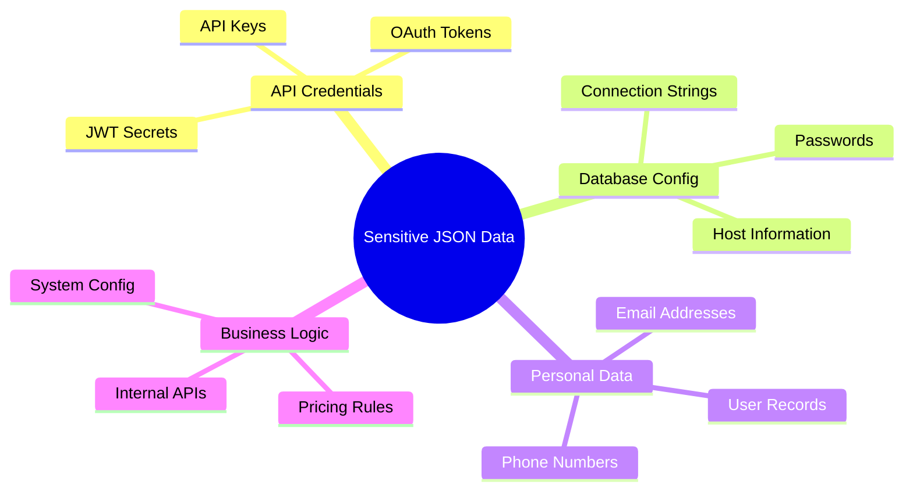
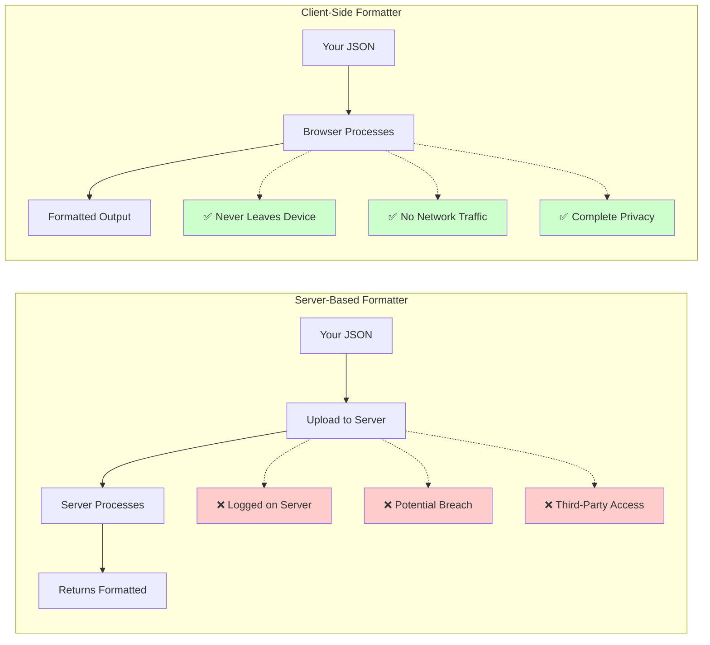
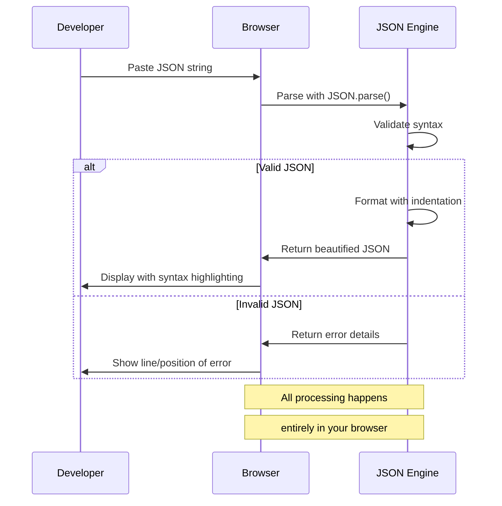
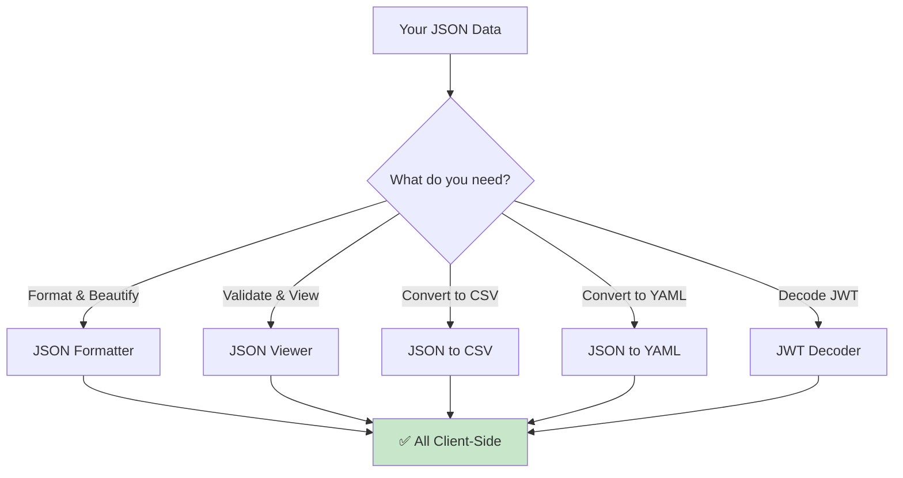
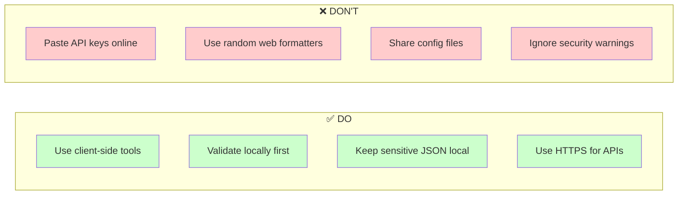
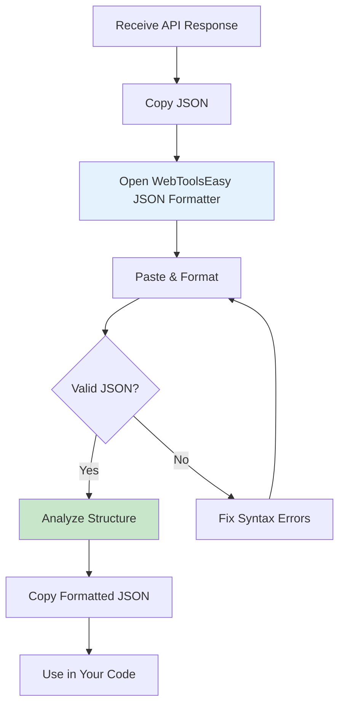

# Client-Side JSON Formatting: The Private Way to Format Data

JSON (JavaScript Object Notation) is everywhere in modern web development. From API responses to configuration files, developers work with JSON constantly. But where should you format and validate your JSON? This guide explains why client-side JSON formatting is essential for protecting sensitive data.

## Why JSON Privacy Matters

When working with JSON, you often encounter highly sensitive data:



Uploading this data to external services puts it at significant risk.

## Client-Side vs Server-Based JSON Formatting



### Server-Based Formatters - The Risks

| Risk                  | Description               | Real-World Impact        |
| --------------------- | ------------------------- | ------------------------ |
| **Data Logging**      | Servers may log your JSON | API keys exposed in logs |
| **Man-in-the-Middle** | Network interception      | Credentials stolen       |
| **Data Retention**    | No deletion guarantee     | Long-term exposure       |
| **Terms of Service**  | May allow data use        | Legal complications      |

### Client-Side Formatters - The Benefits

| Benefit                | Description            | Why It Matters           |
| ---------------------- | ---------------------- | ------------------------ |
| **Zero Transmission**  | Never leaves browser   | No network vulnerability |
| **Instant Processing** | No server latency      | Faster workflow          |
| **Offline Capable**    | Works without internet | Always available         |
| **Open Source**        | Inspectable code       | Trust but verify         |

## How Client-Side JSON Tools Work

Modern browsers have the power to format JSON without server assistance:



All processing happens on your computer, making it completely private.

## Common JSON Formatting Use Cases

### 1. API Development & Testing

When testing APIs, you receive JSON responses containing sensitive data:

```json
{
  "user": {
    "id": 12345,
    "name": "John Developer",
    "email": "john@company.com",
    "api_key": "sk_live_abc123xyz789",
    "permissions": ["read", "write", "admin"]
  }
}
```

Format it locally with [WebToolsEasy JSON Formatter](https://webtoolseasy.com/tools/json-formatter) to inspect response structure without exposing API keys to external tools.

### 2. Configuration File Debugging

Development configurations often contain database credentials:

```json
{
  "database": {
    "host": "internal-db.company.com",
    "port": 5432,
    "username": "admin",
    "password": "super_secret_password_123",
    "ssl": true
  }
}
```

**Never upload these to server-based tools!**

### 3. JWT Token Inspection

JWT tokens contain encoded user data and permissions:

```json
{
  "sub": "1234567890",
  "name": "John Doe",
  "role": "admin",
  "iat": 1516239022,
  "exp": 1516325422
}
```

Use [WebToolsEasy JWT Decoder](https://webtoolseasy.com/tools/jwt-decoder) for private token inspection.

## WebToolsEasy JSON Tools Suite

We offer a complete suite of privacy-first JSON tools:



| Tool               | Purpose                       | Link                                                      |
| ------------------ | ----------------------------- | --------------------------------------------------------- |
| **JSON Formatter** | Beautify & validate JSON      | [Use Tool](https://webtoolseasy.com/tools/json-formatter) |
| **JSON Viewer**    | Tree view & navigation        | [Use Tool](https://webtoolseasy.com/tools/json-viewer)    |
| **JSON to CSV**    | Convert to spreadsheet format | [Use Tool](https://webtoolseasy.com/tools/json-to-csv)    |
| **JSON to YAML**   | Convert to YAML format        | [Use Tool](https://webtoolseasy.com/tools/json-to-yaml)   |
| **JWT Decoder**    | Decode JWT tokens             | [Use Tool](https://webtoolseasy.com/tools/jwt-decoder)    |

## Best Practices for JSON Handling

### Do's and Don'ts



### Security Checklist

1. ✅ **Always use client-side tools for sensitive data**
2. ✅ **Never paste API credentials into untrusted web forms**
3. ✅ **Verify the tool works offline before trusting it**
4. ✅ **Check for open-source code when possible**
5. ✅ **Rotate credentials if accidentally exposed**

## Developer Workflow Integration

Integrate privacy-first JSON formatting into your daily workflow:



## Comparison: Popular JSON Formatters

| Feature                | WebToolsEasy | Online Tool A | Online Tool B |
| ---------------------- | ------------ | ------------- | ------------- |
| Client-Side Processing | ✅ Yes       | ❌ Server     | ❌ Server     |
| No Data Upload         | ✅ Yes       | ❌ No         | ❌ No         |
| Works Offline          | ✅ Yes       | ❌ No         | ❌ No         |
| No Registration        | ✅ Yes       | ⚠️ Optional   | ❌ Required   |
| Syntax Highlighting    | ✅ Yes       | ✅ Yes        | ✅ Yes        |
| Error Detection        | ✅ Yes       | ✅ Yes        | ✅ Yes        |
| Free                   | ✅ Yes       | ⚠️ Limited    | ❌ Paid       |

## Conclusion

For developers working with sensitive JSON data, client-side formatting tools are essential. The privacy risks of server-based tools are simply not worth the convenience.

Use [WebToolsEasy's JSON Formatter](https://webtoolseasy.com/tools/json-formatter) and related tools to:

- ✅ Keep your API credentials private
- ✅ Format JSON without network transmission
- ✅ Work offline with complete security
- ✅ Trust but verify with open-source code

**Your data. Your browser. Your privacy.**
