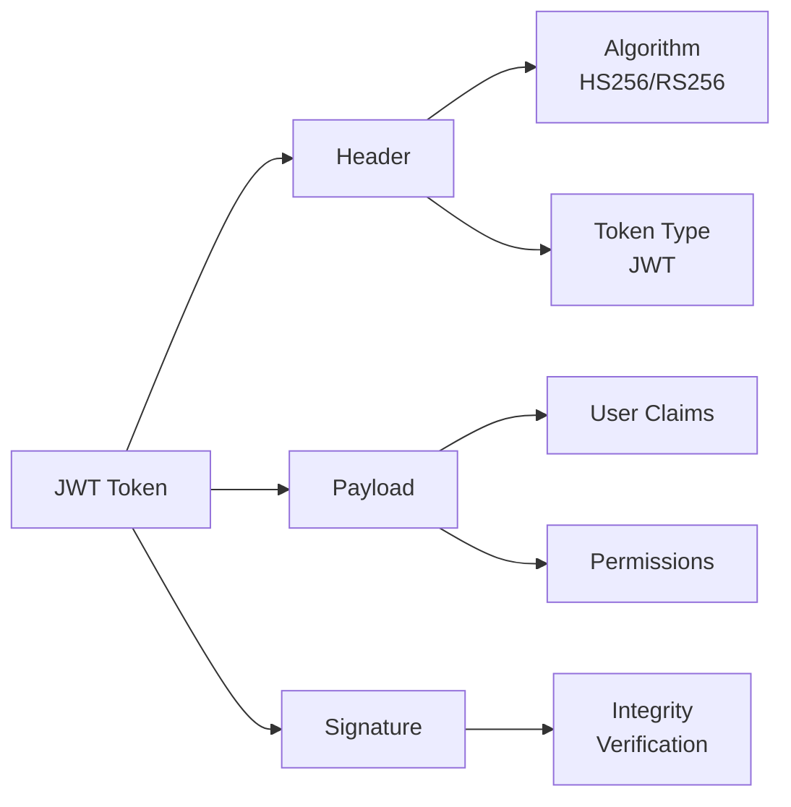
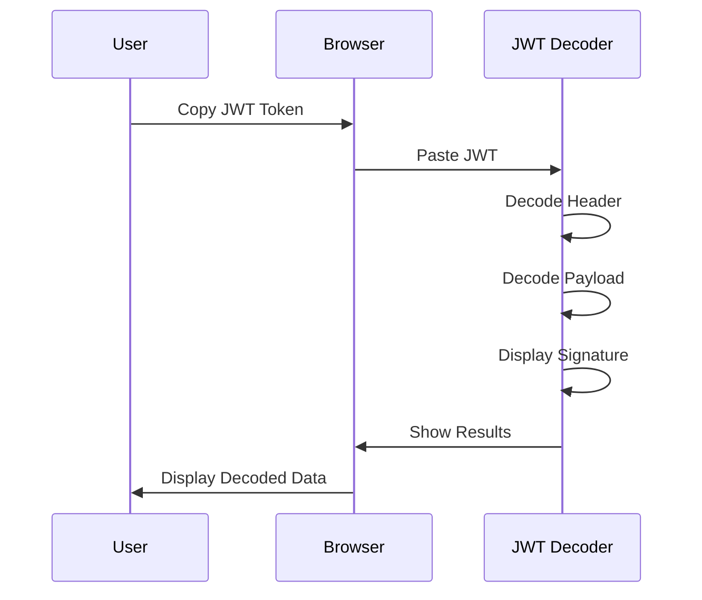

# Decoding JSON Web Tokens (JWTs): A Comprehensive Guide

JSON Web Tokens (JWTs) have become a cornerstone of modern web application security, enabling secure data transmission between parties. Whether you're a seasoned developer, a curious tester, or simply someone looking to understand how JWTs work, this article will provide a comprehensive overview of JWT decoding. Plus, we'll introduce you to a fantastic free online tool – [WebToolsEasy JWT Decoder](https://webtoolseasy.com/tools/jwt-decoder) – that simplifies the process.

## What is JWT?

A JSON Web Token (JWT) is an open standard (RFC 7519) that defines a compact and self-contained way for securely transmitting information between parties as a JSON object. Think of it as a digital passport for your application, verifying the identity of the user and granting them access to specific resources.

A JWT consists of three parts, separated by dots (.):

1. **Header** - Contains metadata about the token, such as the algorithm used for signing (e.g., HS256, RS256) and the token type.

2. **Payload** - Carries the claims – statements about the user or entity. These claims can be registered (predefined), public, or private. Examples include user ID, name, email, and roles.

3. **Signature** - Ensures the integrity of the token, verifying that it hasn't been tampered with. It's created by combining the encoded header, the encoded payload, a secret key (or public/private key pair), and the algorithm specified in the header.

## How does JWT decoding enhance security in applications

JWT decoding itself doesn't directly enhance security, but the process of decoding and validating JWTs is crucial for securing applications. Here's how:

- **Authentication and Authorization** - By decoding and validating the claims within a JWT, applications can verify the identity of the user and their authorized permissions. This allows the application to determine if the user has the right to access specific resources or perform certain actions.

- **Data Integrity** - JWTs use a signature to ensure that the token hasn't been tampered with during transmission. After decoding the JWT, the application can verify the signature to confirm that the data is intact and trustworthy.

- **Verification of Claims** - Decoding allows you to validate the claims. For instance, you can ascertain if the issuer matches expectations or verify if the token has exceeded the expiry timeframe by auditing the claim.

- **Detection of Malicious Tokens** - If the signature verification fails or the claims are invalid, the application can reject the token, preventing unauthorized access or malicious activity.

- **Enhanced Security** - JWTs can be encrypted to protect sensitive data, ensuring that only intended recipients can read the token's content. The use of digital signatures ensures that the token has not been tampered with during transmission.

## Why decode JWTs?

Decoding a JWT allows you to inspect its contents and understand the claims it contains. This is useful for:

- **Debugging** - Identifying issues with token generation or validation.
- **Security Auditing** - Examining the claims and ensuring they align with expected permissions.
- **Testing** - Verifying that the correct information is being passed in the token.
- **Learning** - Gaining a deeper understanding of JWT structure and functionality.

## Introducing the WebToolsEasy JWT Decoder

Manually decoding a JWT can be cumbersome. That's where [WebToolsEasy JWT Decoder](https://webtoolseasy.com/tools/jwt-decoder) comes in. This free online tool provides a quick and easy way to decode JWTs and view their contents in a human-readable format.

### Key Features of the WebToolsEasy JWT Decoder:

- **Free and Easy to Use** - No registration or payment required. Simply paste your JWT and get instant results.
- **Accurate and Reliable** - Decodes JWTs correctly, displaying the header, payload, and signature.
- **Clear Presentation** - Presents the decoded data in a well-formatted and easy-to-understand manner.
- **Copy Functionality** - Easily copy the decoded JWT token data or a shareable link.
- **Versatile** - Handles JWTs encoded in different ways, including base64 and URL-safe encoding.

### How to Use the WebToolsEasy JWT Decoder

1. **Copy Your JWT** - Obtain the JWT you want to decode. This might come from an API response, a cookie, or local storage. Make sure to copy the entire JWT string, including the dots.

2. **Paste into the Tool** - Go to [WebToolsEasy JWT Decoder](https://webtoolseasy.com/tools/jwt-decoder) and paste the JWT into the provided text box.

3. **View Decoded Data** - The tool will instantly decode the JWT and display the header, payload, and signature in separate sections.

## Who Can Benefit from Using a JWT Decoder?

- **Developers** - Decode JWTs during development and testing to ensure they are correctly generated and validated.
- **Testers** - Verify the contents of JWTs to ensure they contain the expected claims and permissions.
- **Security Professionals** - Audit JWTs to identify potential vulnerabilities and ensure proper security practices.
- **Anyone Working with JWTs** - Anyone who needs to understand the contents of a JWT can benefit from using a decoder.

## Tips for Decoding JWTs

- **Always copy the entire JWT string** - Including the dots is crucial for proper decoding.
- **Be mindful of sensitive data** - JWTs can contain sensitive information, so handle them with care.
- **Understand the algorithms used** - Familiarize yourself with common JWT signing algorithms like HS256 and RS256.

## Conclusion

Understanding and decoding JWTs is essential for anyone working with modern web applications. The [WebToolsEasy JWT Decoder](https://webtoolseasy.com/tools/jwt-decoder) provides a valuable resource for decoding JWTs quickly and easily. Whether you're debugging, testing, or simply learning, this free online tool can help you unlock the secrets of JWTs. Give it a try today!
