# Free Calculator Tools: Financial, Math & Everyday Calculators

From calculating loan payments to converting units, calculators are essential tools for daily life and work. This comprehensive guide covers free, browser-based calculator tools that help you make better financial decisions and solve everyday problems - all without sharing your sensitive financial data.

## Why Privacy Matters for Calculator Tools

Financial calculations often involve sensitive personal data:

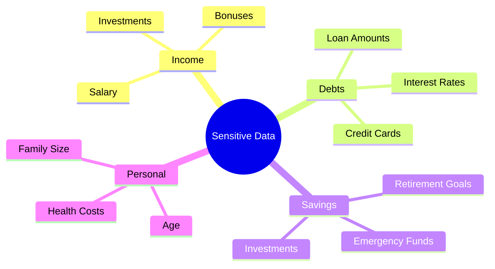

Using online calculators that require login or upload data to servers exposes this information unnecessarily.

## Financial Calculators

### Loan EMI Calculator

Calculate monthly payments for any loan:

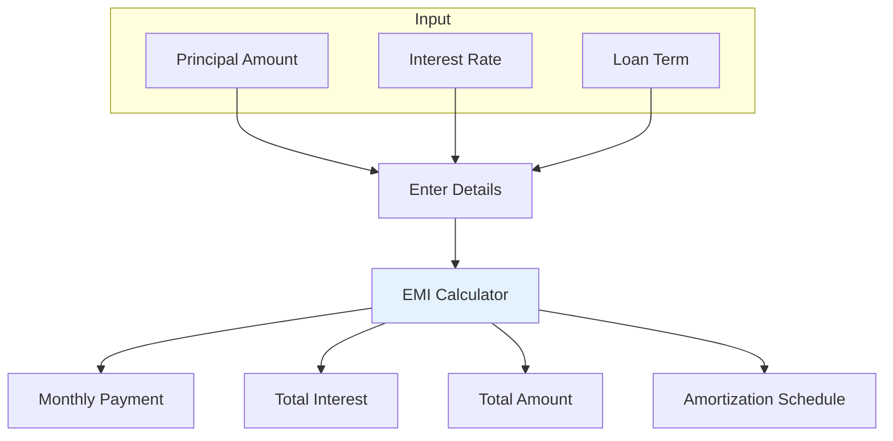

**What You Get:**

- Monthly EMI amount
- Total interest payable
- Total amount payable
- Month-by-month breakdown

[Use EMI Calculator →](https://webtoolseasy.com/tools/loan-emi-calculator)

### Mortgage Calculator

Calculate home loan payments:

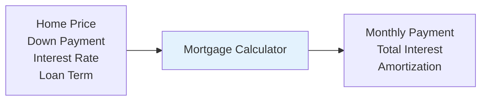

**Includes:**

- Principal & interest breakdown
- Property tax estimates
- Insurance estimates
- Total cost of ownership

[Use Mortgage Calculator →](https://webtoolseasy.com/tools/mortgage-calculator)

### Compound Interest Calculator

See the power of compound growth:

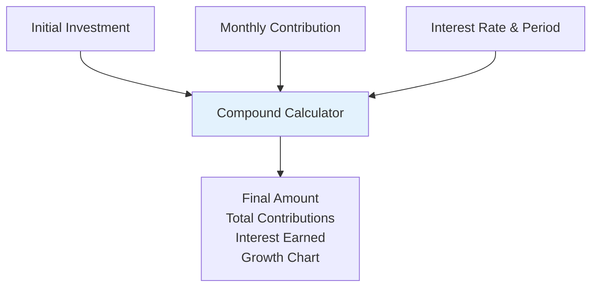

[Use Compound Interest Calculator →](https://webtoolseasy.com/tools/compound-interest-calculator)

### SIP Calculator

Calculate Systematic Investment Plan returns:

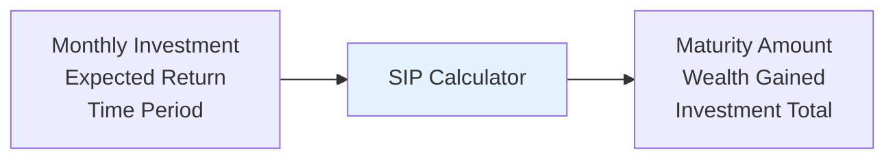

[Use SIP Calculator →](https://webtoolseasy.com/tools/sip-calculator)

### Retirement Calculator

Plan for your retirement:

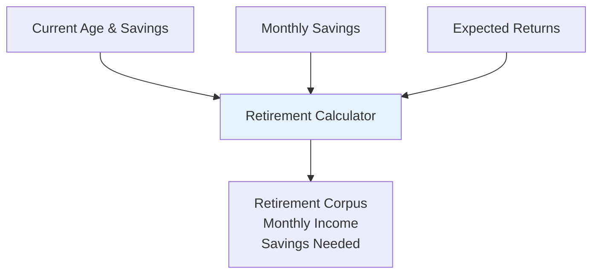

[Use Retirement Calculator →](https://webtoolseasy.com/tools/retirement-calculator)

### ROI Calculator

Calculate Return on Investment:

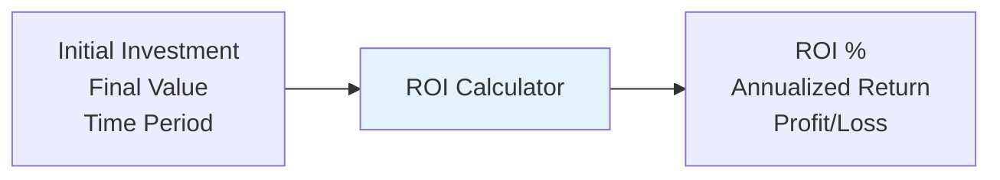

[Use ROI Calculator →](https://webtoolseasy.com/tools/roi-calculator)

## Everyday Calculators

### Percentage Calculator

Calculate percentages easily:

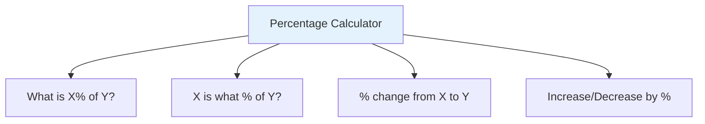

[Use Percentage Calculator →](https://webtoolseasy.com/tools/percentage-calculator)

### Discount Calculator

Calculate sale prices and savings:

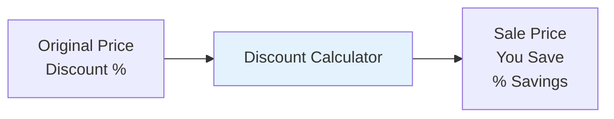

[Use Discount Calculator →](https://webtoolseasy.com/tools/discount-calculator)

### Tip Calculator

Calculate tips and split bills:

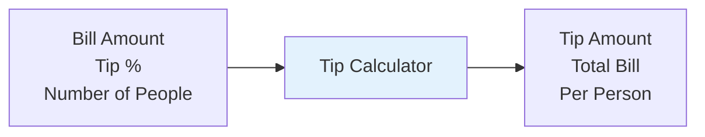

[Use Tip Calculator →](https://webtoolseasy.com/tools/tip-calculator)

### Salary Calculator

Calculate take-home pay:

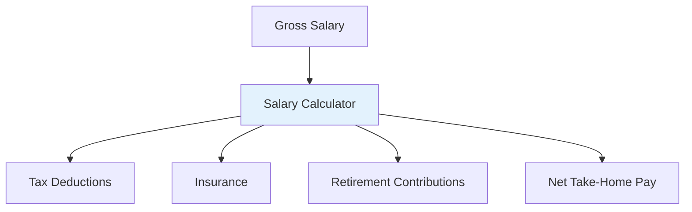

[Use Salary Calculator →](https://webtoolseasy.com/tools/salary-calculator)

## Math & Science Calculators

### Fraction Calculator

Perform fraction operations:

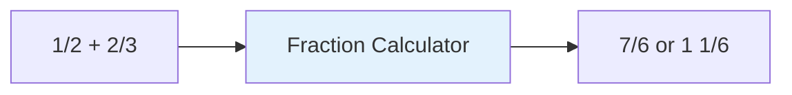

**Operations:**

- Addition, subtraction
- Multiplication, division
- Simplification
- Decimal conversion

[Use Fraction Calculator →](https://webtoolseasy.com/tools/fraction-calculator)

### GPA Calculator

Calculate Grade Point Average:

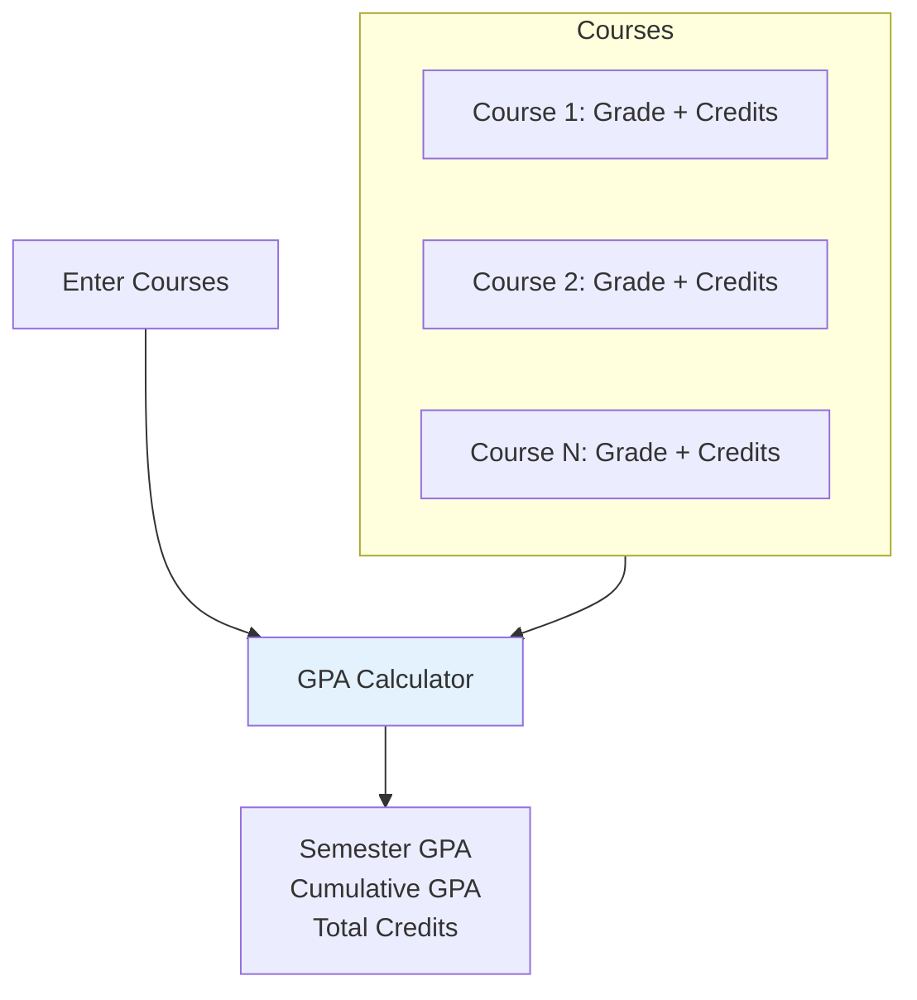

[Use GPA Calculator →](https://webtoolseasy.com/tools/gpa-calculator)

### BMI Calculator

Calculate Body Mass Index:

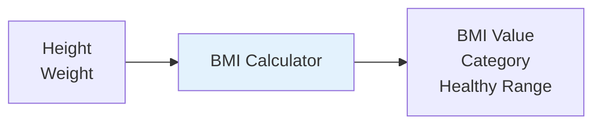

**BMI Categories:**
| BMI | Category |
|-----|----------|
| < 18.5 | Underweight |
| 18.5 - 24.9 | Normal |
| 25 - 29.9 | Overweight |
| ≥ 30 | Obese |

[Use BMI Calculator →](https://webtoolseasy.com/tools/bmi-calculator)

### Calorie Calculator

Calculate daily calorie needs:

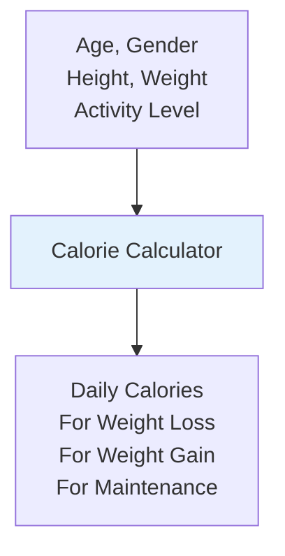

[Use Calorie Calculator →](https://webtoolseasy.com/tools/calorie-calculator)

### Age Calculator

Calculate exact age:

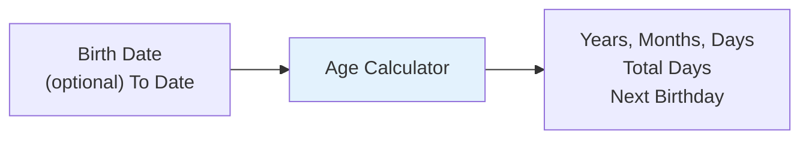

[Use Age Calculator →](https://webtoolseasy.com/tools/age-calculator)

### Date Calculator

Add or subtract dates:

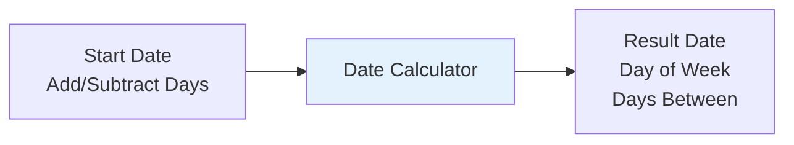

[Use Date Calculator →](https://webtoolseasy.com/tools/date-calculator)

## Unit Converters

### Unit Converter (All-in-One)

Convert between any units:

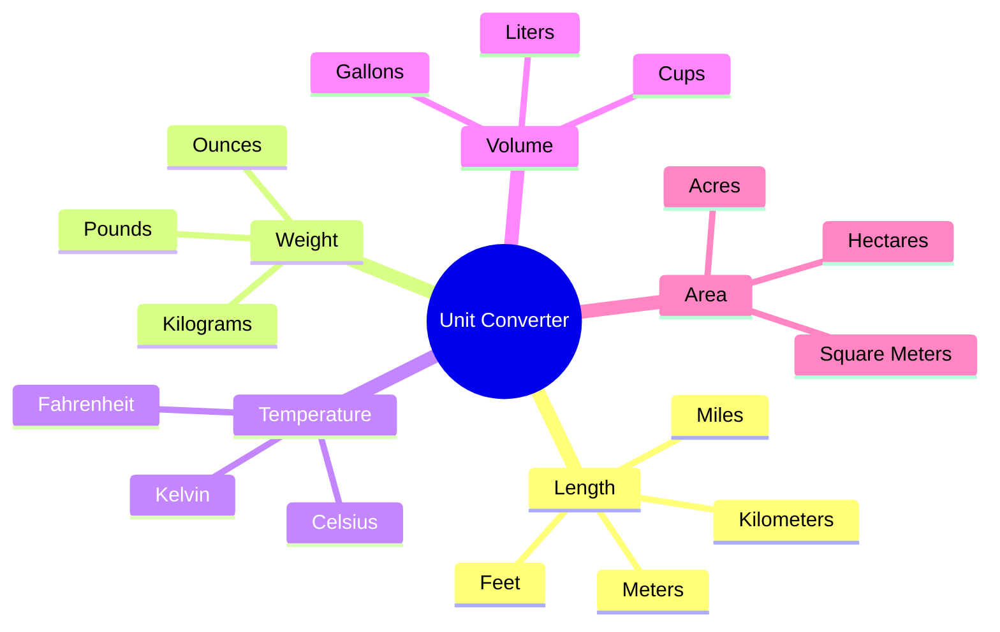

[Use Unit Converter →](https://webtoolseasy.com/tools/unit-converter)

### Currency Converter

Convert between currencies:

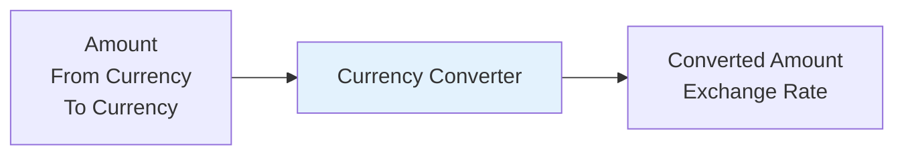

[Use Currency Converter →](https://webtoolseasy.com/tools/currency-converter)

### Timezone Converter

Convert times between timezones:

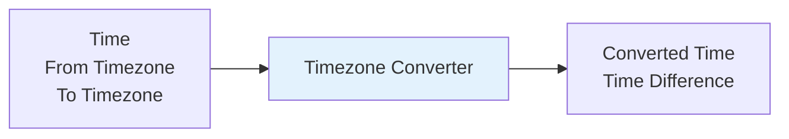

[Use Timezone Converter →](https://webtoolseasy.com/tools/timezone-converter)

## Time Tools

### Countdown Timer

Set countdown timers:

```mermaid
flowchart LR
    A[Set Duration] --> B[Countdown Timer]
    B --> C["Visual Countdown
    Audio Alert"]

    style B fill:#e3f2fd
```

[Use Countdown Timer →](https://webtoolseasy.com/tools/countdown-timer)

### Stopwatch

Track elapsed time:

```mermaid
flowchart LR
    A[Start] --> B[Stopwatch]
    B --> C["Elapsed Time
    Lap Times"]

    style B fill:#e3f2fd
```

[Use Stopwatch →](https://webtoolseasy.com/tools/stopwatch)

### Time Duration Calculator

Calculate time between events:

```mermaid
flowchart LR
    A["Start Time
    End Time"] --> B[Duration Calculator]
    B --> C["Hours
    Minutes
    Seconds"]

    style B fill:#e3f2fd
```

[Use Time Duration Calculator →](https://webtoolseasy.com/tools/time-duration-calculator)

## Complete Calculator Reference

### Financial Calculators

| Tool                      | Purpose              | Link                                                                    |
| ------------------------- | -------------------- | ----------------------------------------------------------------------- |
| **EMI Calculator**        | Loan payments        | [Use Tool](https://webtoolseasy.com/tools/loan-emi-calculator)          |
| **Mortgage Calculator**   | Home loan payments   | [Use Tool](https://webtoolseasy.com/tools/mortgage-calculator)          |
| **Compound Interest**     | Investment growth    | [Use Tool](https://webtoolseasy.com/tools/compound-interest-calculator) |
| **SIP Calculator**        | SIP returns          | [Use Tool](https://webtoolseasy.com/tools/sip-calculator)               |
| **Retirement Calculator** | Retirement planning  | [Use Tool](https://webtoolseasy.com/tools/retirement-calculator)        |
| **ROI Calculator**        | Return on investment | [Use Tool](https://webtoolseasy.com/tools/roi-calculator)               |

### Everyday Calculators

| Tool                      | Purpose         | Link                                                             |
| ------------------------- | --------------- | ---------------------------------------------------------------- |
| **Percentage Calculator** | Percentage math | [Use Tool](https://webtoolseasy.com/tools/percentage-calculator) |
| **Discount Calculator**   | Sale prices     | [Use Tool](https://webtoolseasy.com/tools/discount-calculator)   |
| **Tip Calculator**        | Tips & splits   | [Use Tool](https://webtoolseasy.com/tools/tip-calculator)        |
| **Salary Calculator**     | Take-home pay   | [Use Tool](https://webtoolseasy.com/tools/salary-calculator)     |

### Health & Math

| Tool                    | Purpose         | Link                                                           |
| ----------------------- | --------------- | -------------------------------------------------------------- |
| **BMI Calculator**      | Body mass index | [Use Tool](https://webtoolseasy.com/tools/bmi-calculator)      |
| **Calorie Calculator**  | Daily calories  | [Use Tool](https://webtoolseasy.com/tools/calorie-calculator)  |
| **Fraction Calculator** | Fraction math   | [Use Tool](https://webtoolseasy.com/tools/fraction-calculator) |
| **GPA Calculator**      | Grade average   | [Use Tool](https://webtoolseasy.com/tools/gpa-calculator)      |
| **Age Calculator**      | Exact age       | [Use Tool](https://webtoolseasy.com/tools/age-calculator)      |

## Conclusion

Financial and mathematical calculations involve personal information that shouldn't be shared with third parties. WebToolsEasy provides a complete suite of calculators that:

- ✅ Work 100% in your browser
- ✅ Never upload your financial data
- ✅ Are completely free
- ✅ Work offline
- ✅ Provide accurate results

**Your finances, your privacy, your control.**

---

### Quick Access

**Financial:** [EMI](https://webtoolseasy.com/tools/loan-emi-calculator) | [Mortgage](https://webtoolseasy.com/tools/mortgage-calculator) | [Compound Interest](https://webtoolseasy.com/tools/compound-interest-calculator) | [SIP](https://webtoolseasy.com/tools/sip-calculator)

**Everyday:** [Percentage](https://webtoolseasy.com/tools/percentage-calculator) | [Discount](https://webtoolseasy.com/tools/discount-calculator) | [Tip](https://webtoolseasy.com/tools/tip-calculator)

**Health:** [BMI](https://webtoolseasy.com/tools/bmi-calculator) | [Calorie](https://webtoolseasy.com/tools/calorie-calculator) | [Age](https://webtoolseasy.com/tools/age-calculator)

**Converters:** [Unit](https://webtoolseasy.com/tools/unit-converter) | [Currency](https://webtoolseasy.com/tools/currency-converter) | [Timezone](https://webtoolseasy.com/tools/timezone-converter)
