# Complete Guide to Free Developer Tools: Code Formatting, Testing & Security

Every developer needs a reliable toolkit for everyday tasks. From formatting JSON responses to testing regex patterns, these are the tools you use constantly. But are you using tools that respect your privacy? This comprehensive guide covers essential developer tools that work 100% in your browser.

## Why Developers Need Privacy-First Tools

As developers, we handle sensitive data daily:

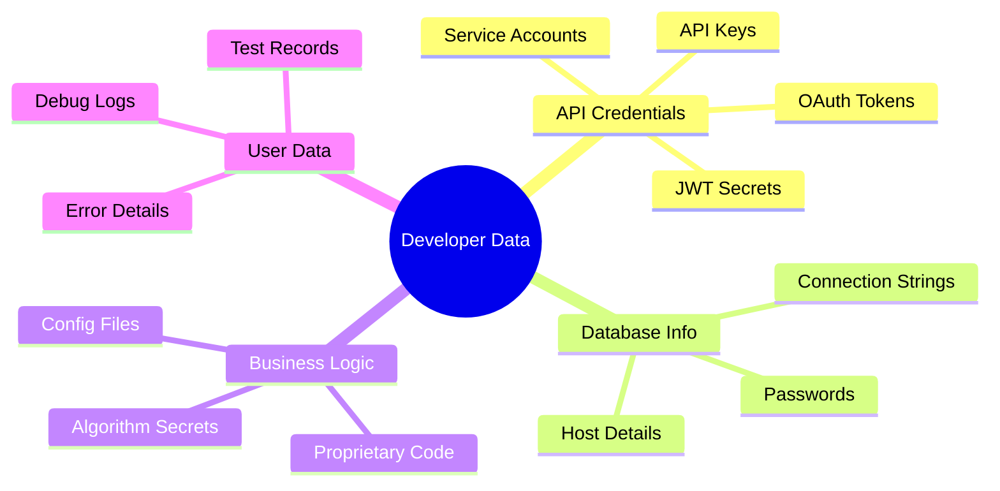

Uploading this to online tools creates unnecessary risk.

## Code Formatting Tools

### JSON Formatter

JSON is the universal data format for APIs. Format and validate JSON without ever uploading your data:

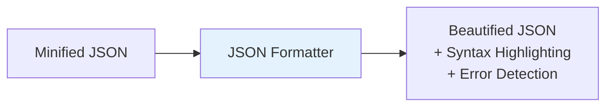

**Key Features:**

- ✅ Syntax highlighting for readability
- ✅ Error detection with line numbers
- ✅ Minify/beautify toggle
- ✅ Copy formatted output

[Use JSON Formatter →](https://webtoolseasy.com/tools/json-formatter)

### HTML Formatter

Clean up messy HTML code:

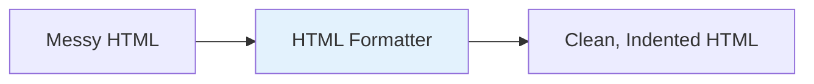

**Key Features:**

- ✅ Proper indentation
- ✅ Tag validation
- ✅ Attribute formatting
- ✅ Works with any HTML

[Use HTML Formatter →](https://webtoolseasy.com/tools/html-formatter)

### CSS Formatter

Beautify your stylesheets:

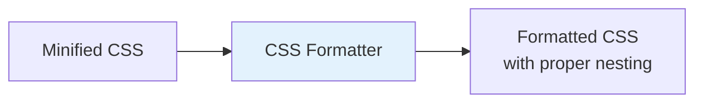

[Use CSS Formatter →](https://webtoolseasy.com/tools/css-formatter)

### JavaScript Formatter

Format and beautify JavaScript code:

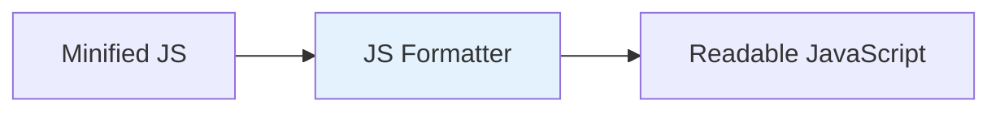

[Use JavaScript Formatter →](https://webtoolseasy.com/tools/javascript-formatter)

### SQL Formatter

Make complex queries readable:

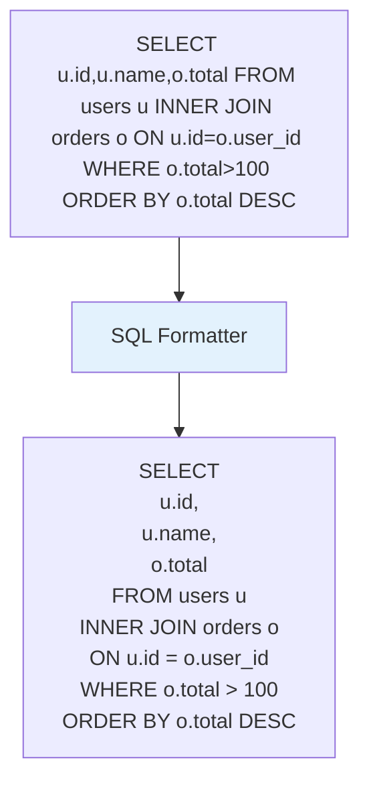

[Use SQL Formatter →](https://webtoolseasy.com/tools/sql-formatter)

### YAML Formatter

Validate and format YAML configurations:

[Use YAML Formatter →](https://webtoolseasy.com/tools/yaml-formatter)

## Encoding & Decoding Tools

### Base64 Encoder/Decoder

Essential for handling encoded data:

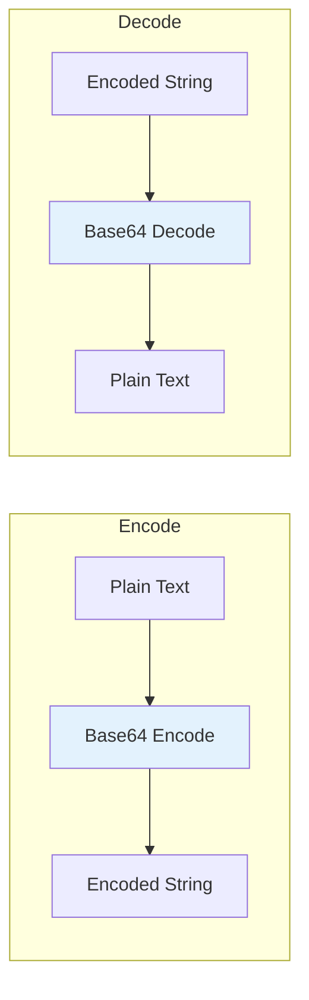

[Use Base64 Encoder →](https://webtoolseasy.com/tools/base64-encode)
[Use Base64 Decoder →](https://webtoolseasy.com/tools/base64-decode)

### URL Encoder/Decoder

Handle URL-safe strings:

[Use URL Encoder/Decoder →](https://webtoolseasy.com/tools/url-encoder-decoder)

### JWT Decoder

Decode and inspect JWT tokens safely:

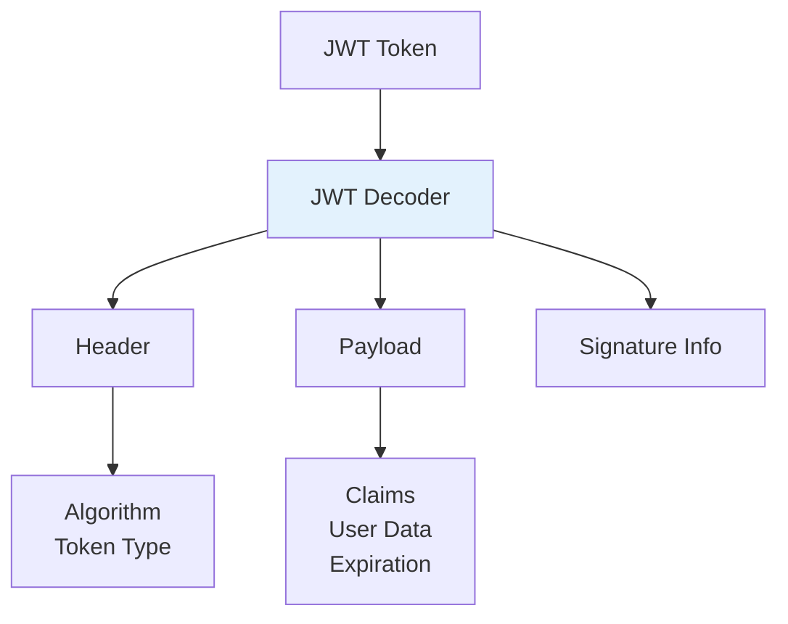

**Never paste JWTs into server-based decoders!** They contain sensitive authentication data.

[Use JWT Decoder →](https://webtoolseasy.com/tools/jwt-decoder)

## Testing & Validation Tools

### Regex Tester

Test regular expressions with live matching:

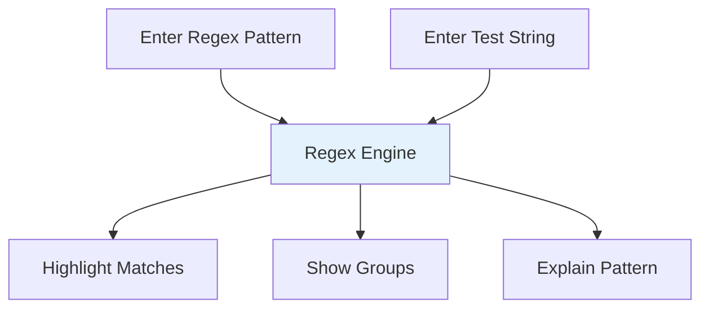

**Key Features:**

- ✅ Real-time matching
- ✅ Group highlighting
- ✅ Multiple flags support
- ✅ Match explanation

[Use Regex Tester →](https://webtoolseasy.com/tools/regex-tester)

### JSON Viewer

Navigate complex JSON structures:

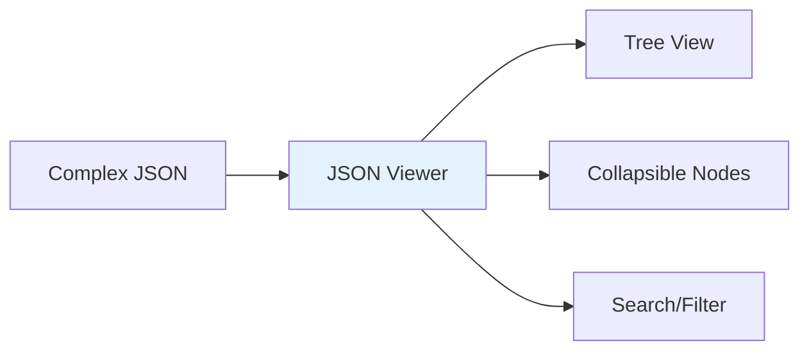

[Use JSON Viewer →](https://webtoolseasy.com/tools/json-viewer)

### Diff Checker

Compare code or text files:

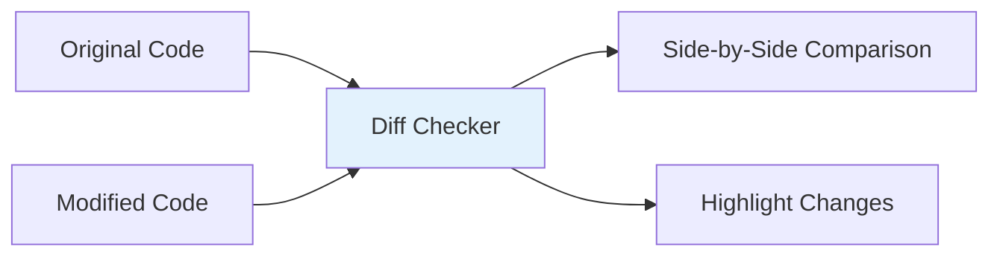

[Use Diff Checker →](https://webtoolseasy.com/tools/diff-checker)

## Security Tools

### Hash Generator

Generate cryptographic hashes locally:

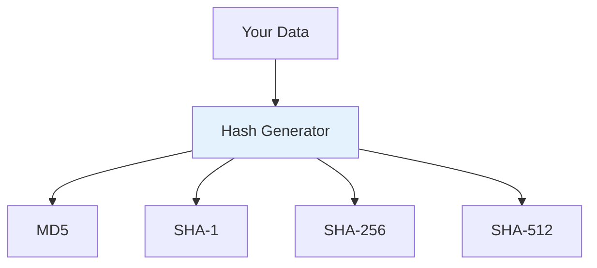

**Supported Algorithms:**

- MD5 (for checksums only)
- SHA-1, SHA-256, SHA-384, SHA-512
- All processing happens locally

[Use Hash Generator →](https://webtoolseasy.com/tools/hash-generator)

### Password Generator

Generate cryptographically secure passwords:

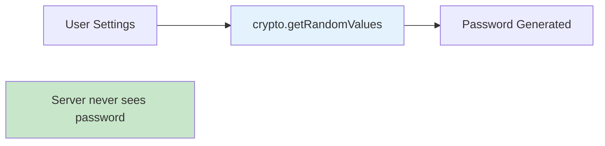

[Use Password Generator →](https://webtoolseasy.com/tools/password-generator)

### UUID Generators

Generate unique identifiers locally:

| Version  | Use Case         | Tool                                                        |
| -------- | ---------------- | ----------------------------------------------------------- |
| **v1**   | Time-based       | [UUID v1](https://webtoolseasy.com/tools/uuid-v1-generator) |
| **v4**   | Random           | [UUID v4](https://webtoolseasy.com/tools/uuid-v4-generator) |
| **v5**   | Name-based       | [UUID v5](https://webtoolseasy.com/tools/uuid-v5-generator) |
| **v7**   | Time-ordered     | [UUID v7](https://webtoolseasy.com/tools/uuid-v7-generator) |
| **ULID** | Sortable         | [ULID](https://webtoolseasy.com/tools/ulid-generator)       |
| **GUID** | Microsoft format | [GUID](https://webtoolseasy.com/tools/guid-generator)       |

## Data Conversion Tools

### JSON Conversions

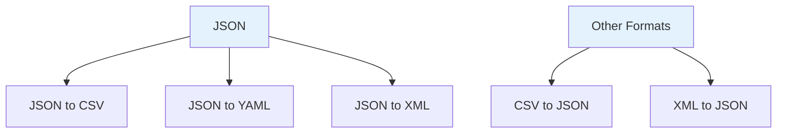

| Conversion  | Link                                                    |
| ----------- | ------------------------------------------------------- |
| JSON → CSV  | [Use Tool](https://webtoolseasy.com/tools/json-to-csv)  |
| JSON → YAML | [Use Tool](https://webtoolseasy.com/tools/json-to-yaml) |
| CSV → JSON  | [Use Tool](https://webtoolseasy.com/tools/csv-to-json)  |
| XML → JSON  | [Use Tool](https://webtoolseasy.com/tools/xml-to-json)  |

### Markdown Tools

| Tool             | Purpose         | Link                                                                  |
| ---------------- | --------------- | --------------------------------------------------------------------- |
| Markdown Editor  | Write & preview | [Use Tool](https://webtoolseasy.com/tools/markdown-editor)            |
| Markdown to HTML | Convert format  | [Use Tool](https://webtoolseasy.com/tools/markdown-to-html-converter) |
| HTML to Markdown | Reverse convert | [Use Tool](https://webtoolseasy.com/tools/html-to-markdown)           |

## Utility Tools

### Cron Expression Builder

Build and validate cron schedules:

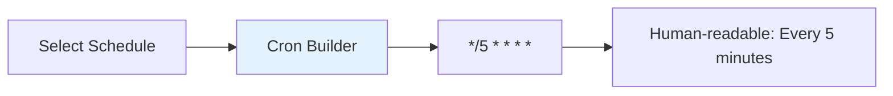

[Use Cron Expression Builder →](https://webtoolseasy.com/tools/cron-expression)

### Unix Timestamp Converter

Convert between timestamps and dates:

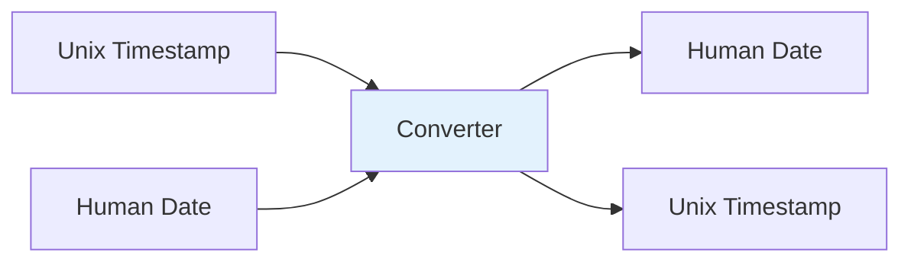

[Use Timestamp Converter →](https://webtoolseasy.com/tools/unix-timestamp-converter)

## Complete Developer Toolkit Overview

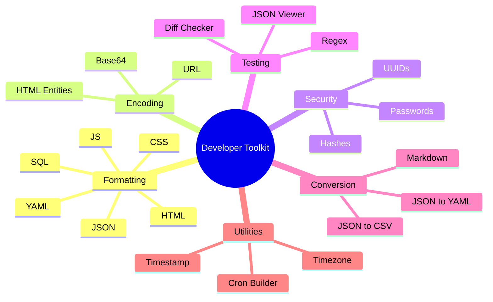

## Why Choose Client-Side Developer Tools?

### Comparison Table

| Feature                | WebToolsEasy | Online Tool A    | Online Tool B    |
| ---------------------- | ------------ | ---------------- | ---------------- |
| Client-Side Processing | ✅ Yes       | ❌ Server        | ❌ Server        |
| Works Offline          | ✅ Yes       | ❌ No            | ❌ No            |
| API Key Safety         | ✅ Safe      | ❌ Exposed       | ❌ Exposed       |
| Free                   | ✅ Yes       | ⚠️ Limited       | ❌ Paid          |
| No Registration        | ✅ Yes       | ❌ Required      | ❌ Required      |
| Speed                  | ✅ Instant   | ⚠️ Network delay | ⚠️ Network delay |

## Conclusion

As developers, we can't afford to compromise on security. Every time you paste an API key, JWT token, or database connection string into an online tool, you're taking a risk.

WebToolsEasy provides 50+ developer tools that:

- ✅ Run 100% in your browser
- ✅ Never send data to servers
- ✅ Work offline
- ✅ Are completely free

**Code safely. Use client-side tools.**

---

### Quick Links by Category

**Formatters:** [JSON](https://webtoolseasy.com/tools/json-formatter) | [HTML](https://webtoolseasy.com/tools/html-formatter) | [CSS](https://webtoolseasy.com/tools/css-formatter) | [JS](https://webtoolseasy.com/tools/javascript-formatter) | [SQL](https://webtoolseasy.com/tools/sql-formatter)

**Encoding:** [Base64](https://webtoolseasy.com/tools/base64-encode) | [URL](https://webtoolseasy.com/tools/url-encoder-decoder) | [JWT](https://webtoolseasy.com/tools/jwt-decoder)

**Security:** [Hash](https://webtoolseasy.com/tools/hash-generator) | [Password](https://webtoolseasy.com/tools/password-generator) | [UUID](https://webtoolseasy.com/tools/uuid-v4-generator)

**Testing:** [Regex](https://webtoolseasy.com/tools/regex-tester) | [Diff](https://webtoolseasy.com/tools/diff-checker) | [JSON Viewer](https://webtoolseasy.com/tools/json-viewer)
