# Ultimate Guide to Free Image Editing Tools: Compress, Resize, Convert & More

Images are everywhere online - from social media posts to professional portfolios. But editing images often means using expensive software or uploading your photos to unknown servers. This guide introduces you to powerful, free image tools that work entirely in your browser, keeping your photos private and secure.

## Why Browser-Based Image Tools?

Traditional image editing requires either expensive software or uploading to online services:

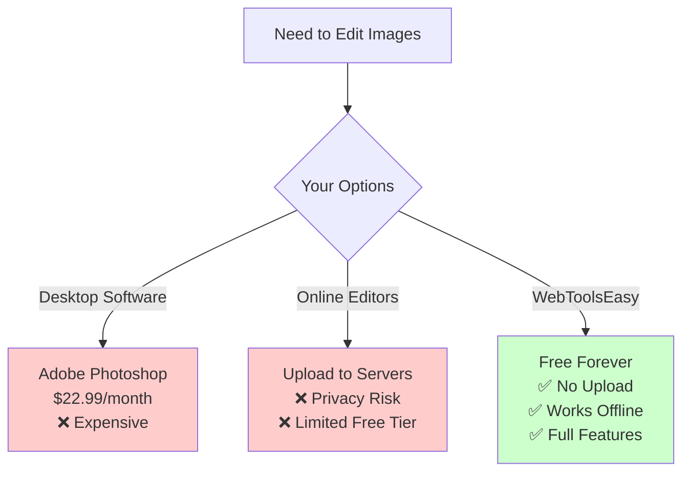

## Complete Image Toolkit

### Image Compression

Reduce file sizes without visible quality loss:

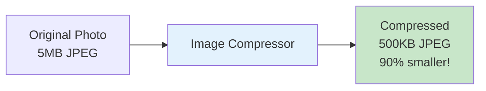

**How Compression Works:**

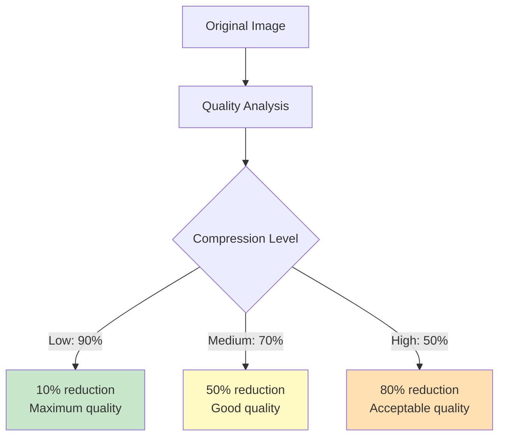

**Best Practices:**
| Use Case | Quality Level | Expected Reduction |
|----------|---------------|-------------------|
| Print | 90-100% | 10-20% |
| Web/Email | 70-80% | 40-60% |
| Thumbnails | 50-60% | 70-80% |

[Use Image Compressor →](https://webtoolseasy.com/tools/image-compress)

### Image Resizing

Change image dimensions for any purpose:

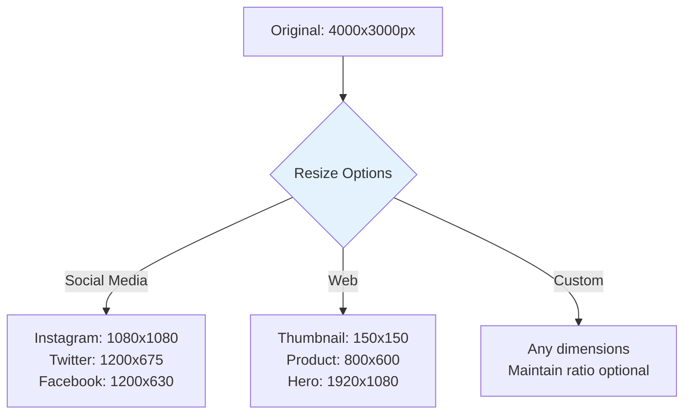

**Common Sizes Quick Reference:**

| Platform        | Recommended Size | Aspect Ratio |
| --------------- | ---------------- | ------------ |
| Instagram Post  | 1080 × 1080      | 1:1          |
| Instagram Story | 1080 × 1920      | 9:16         |
| Twitter Post    | 1200 × 675       | 16:9         |
| Facebook Post   | 1200 × 630       | 1.91:1       |
| LinkedIn Post   | 1200 × 627       | 1.91:1       |
| Website Hero    | 1920 × 1080      | 16:9         |

[Use Image Resizer →](https://webtoolseasy.com/tools/image-resizer)

### Image Format Conversion

Convert between image formats:

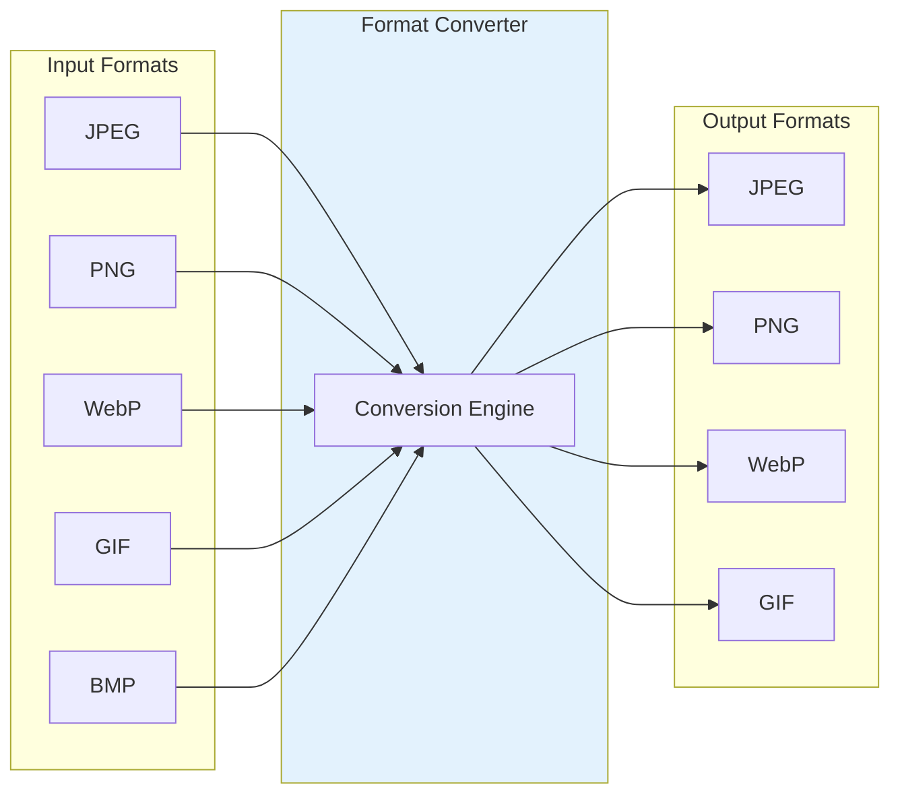

**Format Guide:**

| Format   | Best For        | Transparency | File Size |
| -------- | --------------- | ------------ | --------- |
| **JPEG** | Photos          | ❌ No        | Small     |
| **PNG**  | Graphics, logos | ✅ Yes       | Medium    |
| **WebP** | Modern web      | ✅ Yes       | Smallest  |
| **GIF**  | Animations      | ✅ Yes       | Medium    |

[Use Image Format Converter →](https://webtoolseasy.com/tools/image-format-converter)

### Crop Image

Crop images to exact dimensions:

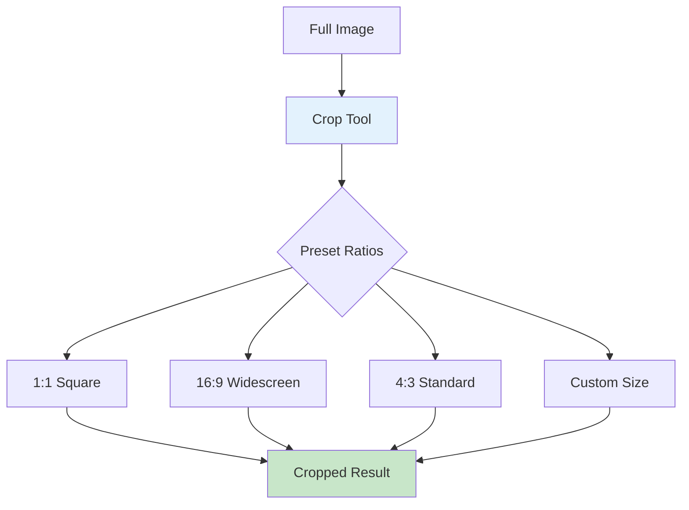

[Use Crop Tool →](https://webtoolseasy.com/tools/crop-image)

### Background Remover

Remove backgrounds with AI - locally:

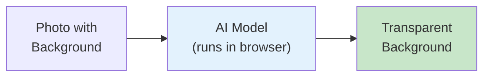

**Use Cases:**

- ✅ Product photography
- ✅ Profile pictures
- ✅ Social media graphics
- ✅ Design mockups

[Use Background Remover →](https://webtoolseasy.com/tools/background-remover)

## Advanced Image Tools

### GIF Maker

Create animated GIFs from images or videos:

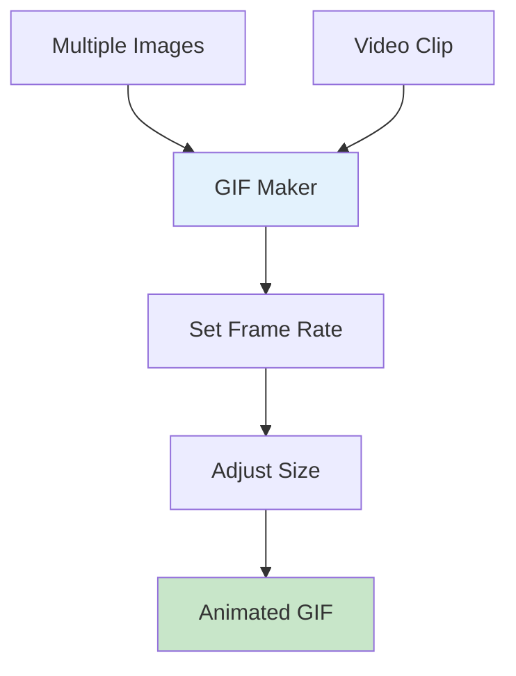

[Use GIF Maker →](https://webtoolseasy.com/tools/gif-maker)

### QR Code Generator

Create QR codes for any content:

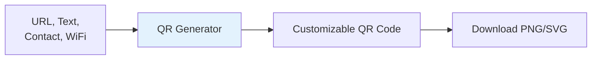

[Use QR Code Generator →](https://webtoolseasy.com/tools/qr-code-generator)

### Favicon Generator

Create favicons for websites:

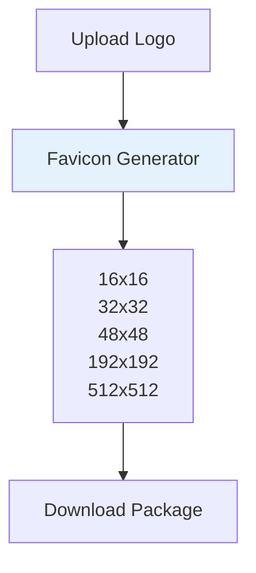

[Use Favicon Generator →](https://webtoolseasy.com/tools/favicon-generator)

### Meme Generator

Create memes instantly:

[Use Meme Generator →](https://webtoolseasy.com/tools/meme-generator)

## Image Workflow Examples

### Social Media Preparation

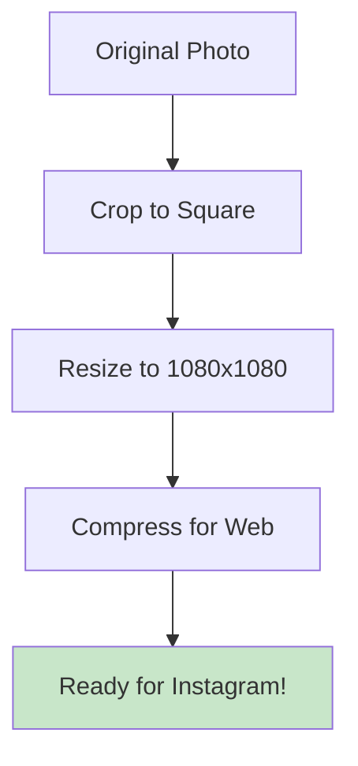

### Website Optimization

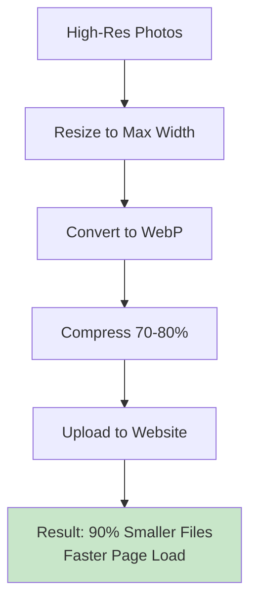

### E-commerce Product Photos

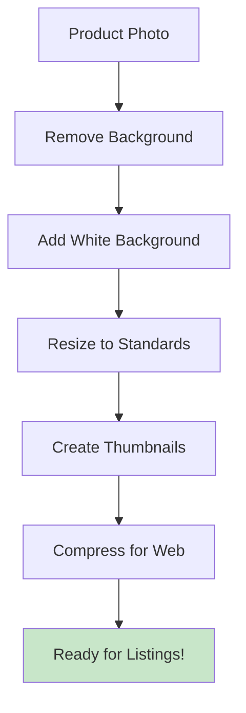

## Complete Image Tools Reference

| Tool                   | Purpose            | Link                                                              |
| ---------------------- | ------------------ | ----------------------------------------------------------------- |
| **Image Compress**     | Reduce file size   | [Use Tool](https://webtoolseasy.com/tools/image-compress)         |
| **Image Resizer**      | Change dimensions  | [Use Tool](https://webtoolseasy.com/tools/image-resizer)          |
| **Format Converter**   | Change format      | [Use Tool](https://webtoolseasy.com/tools/image-format-converter) |
| **Crop Image**         | Crop to size       | [Use Tool](https://webtoolseasy.com/tools/crop-image)             |
| **Background Remover** | Remove background  | [Use Tool](https://webtoolseasy.com/tools/background-remover)     |
| **GIF Maker**          | Create animations  | [Use Tool](https://webtoolseasy.com/tools/gif-maker)              |
| **QR Code Generator**  | Generate QR codes  | [Use Tool](https://webtoolseasy.com/tools/qr-code-generator)      |
| **Favicon Generator**  | Create favicons    | [Use Tool](https://webtoolseasy.com/tools/favicon-generator)      |
| **Meme Generator**     | Create memes       | [Use Tool](https://webtoolseasy.com/tools/meme-generator)         |
| **Image to Text**      | Extract text (OCR) | [Use Tool](https://webtoolseasy.com/tools/image-to-text)          |

## Privacy Comparison

| Feature                | WebToolsEasy | Canva       | Adobe Express |
| ---------------------- | ------------ | ----------- | ------------- |
| Client-Side Processing | ✅ Yes       | ❌ Server   | ❌ Server     |
| No Account Required    | ✅ Yes       | ❌ Required | ❌ Required   |
| Works Offline          | ✅ Yes       | ❌ No       | ❌ No         |
| Free                   | ✅ Yes       | ⚠️ Limited  | ⚠️ Limited    |
| No File Upload         | ✅ Yes       | ❌ Required | ❌ Required   |
| Privacy Guaranteed     | ✅ Yes       | ❌ No       | ❌ No         |

## Conclusion

Professional image editing doesn't require expensive software or compromising your privacy. WebToolsEasy provides a complete suite of image tools that:

- ✅ Work 100% in your browser
- ✅ Never upload your photos
- ✅ Are completely free
- ✅ Work offline
- ✅ Match professional results

**Your photos, your privacy, your control.**

Start editing your images now - no signup, no upload, no worries.

---

### Quick Access

**Essential Tools:** [Compress](https://webtoolseasy.com/tools/image-compress) | [Resize](https://webtoolseasy.com/tools/image-resizer) | [Crop](https://webtoolseasy.com/tools/crop-image) | [Convert](https://webtoolseasy.com/tools/image-format-converter)

**Creative Tools:** [Background Remover](https://webtoolseasy.com/tools/background-remover) | [GIF Maker](https://webtoolseasy.com/tools/gif-maker) | [Meme Generator](https://webtoolseasy.com/tools/meme-generator)

**Utility Tools:** [QR Code](https://webtoolseasy.com/tools/qr-code-generator) | [Favicon](https://webtoolseasy.com/tools/favicon-generator) | [Image to Text](https://webtoolseasy.com/tools/image-to-text)
