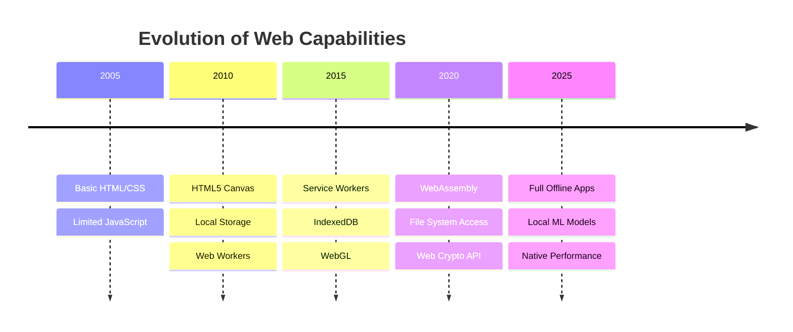
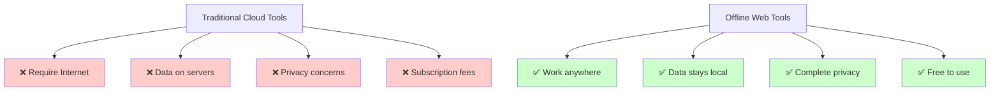
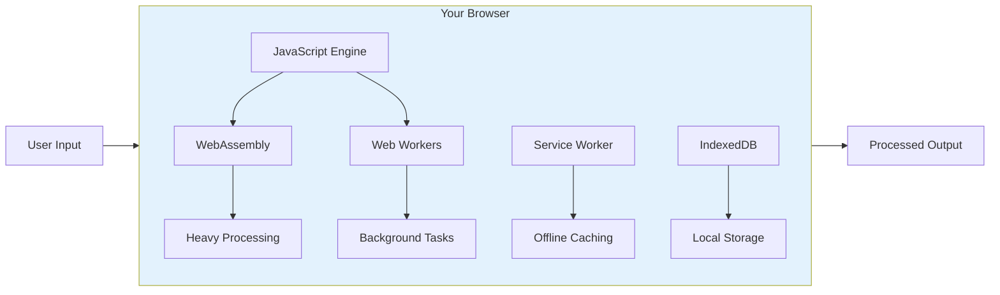
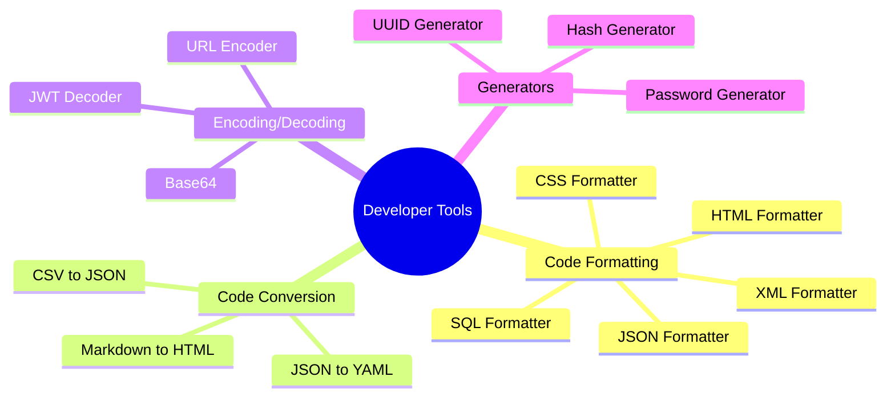
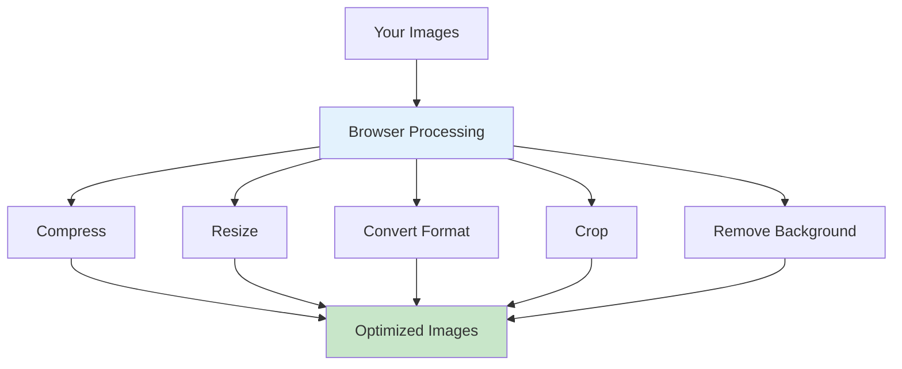
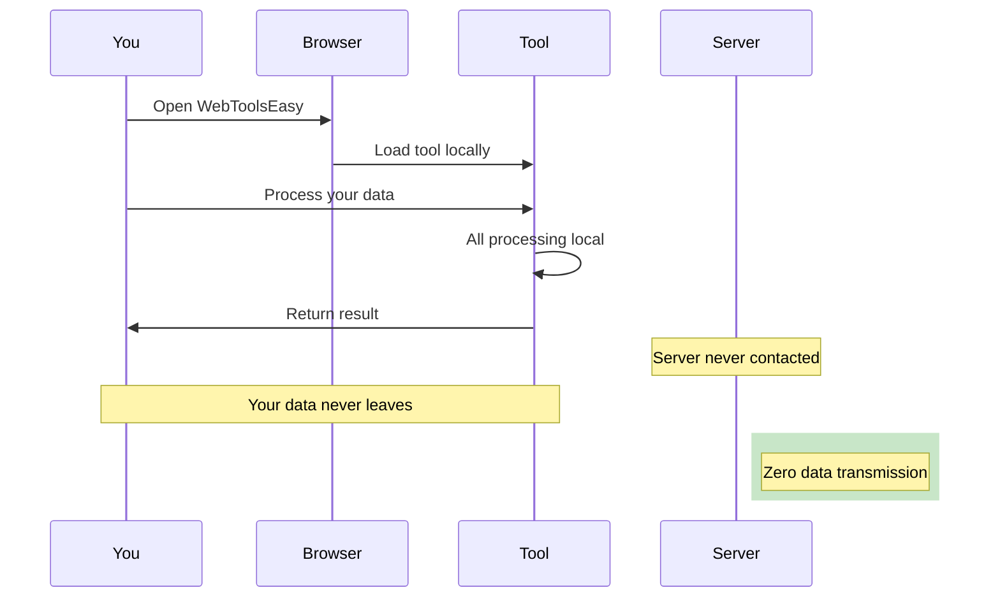
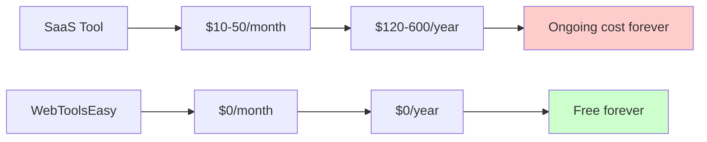
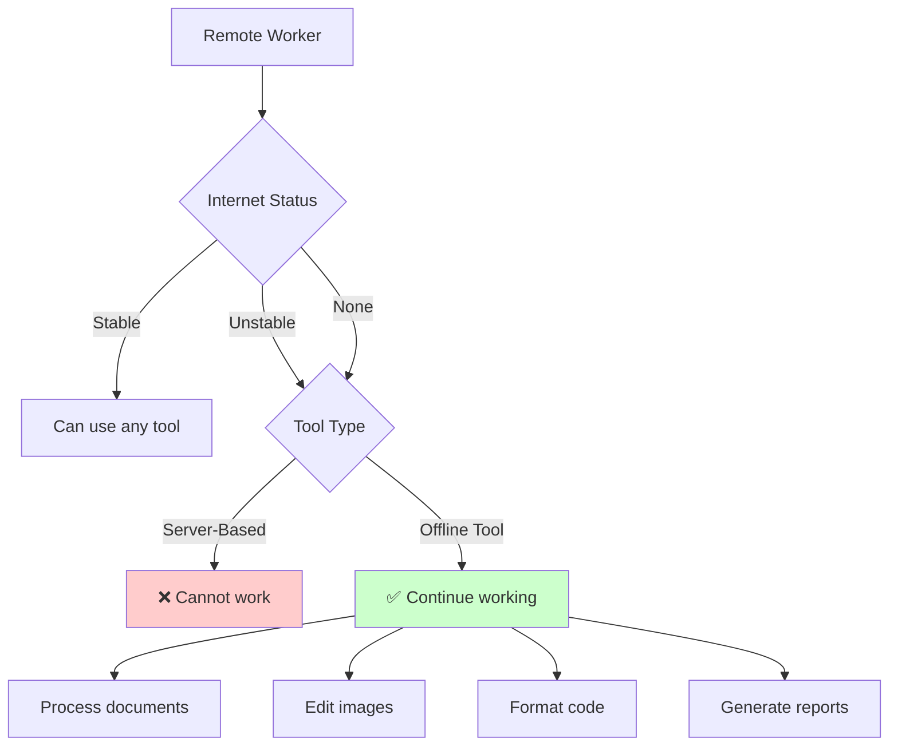
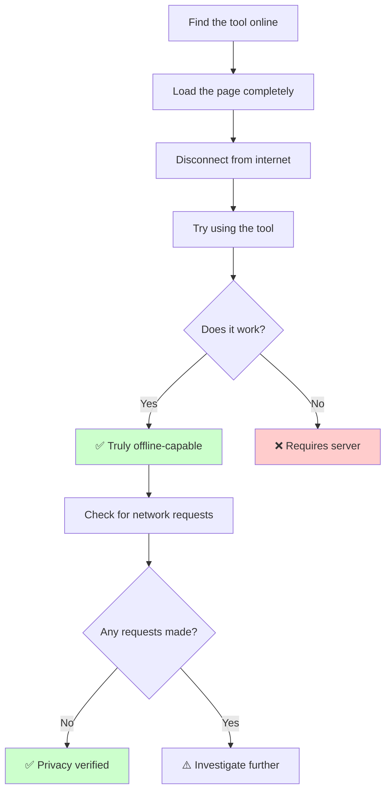

# Offline Web Tools: Why Browser-Based Tools Are the Future

The internet has revolutionized how we work, but it has also created a dependency on constant connectivity and cloud services. What if you could access powerful tools that work offline, protect your privacy, and never require you to trust a third party with your data? Welcome to the world of client-side web tools.

## The Rise of Offline-First Web Applications

Modern web browsers have evolved from simple document viewers to powerful application platforms:

### Why This Matters for You

## How Offline Web Tools Work

Client-side web applications leverage several modern browser technologies:

### Key Technologies Explained

| Technology          | Purpose                 | Example Use                    |
| ------------------- | ----------------------- | ------------------------------ |
| **WebAssembly**     | Near-native performance | Image processing, PDF handling |
| **Service Workers** | Offline caching         | Load app without internet      |
| **IndexedDB**       | Large data storage      | Store files locally            |
| **Web Crypto API**  | Secure operations       | Password generation, hashing   |
| **Canvas API**      | Image manipulation      | Compression, cropping          |
| **File API**        | File handling           | Read/write local files         |

## Categories of Offline Web Tools

WebToolsEasy offers 115+ tools that work entirely in your browser:

### Developer Tools

| Tool                                                                 | Works Offline | No Server |
| -------------------------------------------------------------------- | ------------- | --------- |
| [JSON Formatter](https://webtoolseasy.com/tools/json-formatter)      | ✅            | ✅        |
| [HTML Formatter](https://webtoolseasy.com/tools/html-formatter)      | ✅            | ✅        |
| [Regex Tester](https://webtoolseasy.com/tools/regex-tester)          | ✅            | ✅        |
| [Base64 Encode/Decode](https://webtoolseasy.com/tools/base64-encode) | ✅            | ✅        |

### Image Tools

| Tool                                                                    | Works Offline | No Server |
| ----------------------------------------------------------------------- | ------------- | --------- |
| [Image Compress](https://webtoolseasy.com/tools/image-compress)         | ✅            | ✅        |
| [Image Resizer](https://webtoolseasy.com/tools/image-resizer)           | ✅            | ✅        |
| [Background Remover](https://webtoolseasy.com/tools/background-remover) | ✅            | ✅        |
| [GIF Maker](https://webtoolseasy.com/tools/gif-maker)                   | ✅            | ✅        |

### PDF Tools

All PDF processing happens locally:

| Tool                                                        | Works Offline | No Server |
| ----------------------------------------------------------- | ------------- | --------- |
| [PDF Editor](https://webtoolseasy.com/tools/pdf-editor)     | ✅            | ✅        |
| [PDF Merge](https://webtoolseasy.com/tools/pdf-merge)       | ✅            | ✅        |
| [PDF Split](https://webtoolseasy.com/tools/pdf-split)       | ✅            | ✅        |
| [PDF Compress](https://webtoolseasy.com/tools/pdf-compress) | ✅            | ✅        |

### Text & Writing Tools

| Tool                                                                          | Works Offline | No Server |
| ----------------------------------------------------------------------------- | ------------- | --------- |
| [Word Counter](https://webtoolseasy.com/tools/word-counter)                   | ✅            | ✅        |
| [Case Converter](https://webtoolseasy.com/tools/case-converter)               | ✅            | ✅        |
| [Lorem Ipsum Generator](https://webtoolseasy.com/tools/lorem-ipsum-generator) | ✅            | ✅        |
| [Text Compare](https://webtoolseasy.com/tools/text-compare)                   | ✅            | ✅        |

## Benefits of Offline-First Tools

### 1. Privacy by Design

### 2. Works Anywhere

| Scenario           | Online Tools      | Offline Tools |
| ------------------ | ----------------- | ------------- |
| No WiFi            | ❌ Useless        | ✅ Works      |
| Airplane Mode      | ❌ Useless        | ✅ Works      |
| Poor Connection    | ⚠️ Slow           | ✅ Fast       |
| Remote Location    | ❌ Useless        | ✅ Works      |
| Secure Environment | ❌ May be blocked | ✅ Works      |

### 3. No Subscription Fees

### 4. Performance Advantages

| Metric          | Server-Based        | Client-Side     |
| --------------- | ------------------- | --------------- |
| **Latency**     | 200-500ms (network) | <10ms (instant) |
| **File Upload** | Required            | Not needed      |
| **Processing**  | Server queue        | Immediate       |
| **Large Files** | Limited by upload   | Limited by RAM  |

## Real-World Use Cases

### Remote Work Scenario

### Secure Environment Scenario

For organizations with strict data policies:

1. **Government Agencies** - No data leaves the network
2. **Healthcare** - HIPAA compliance without cloud risk
3. **Legal Firms** - Attorney-client privilege protection
4. **Financial Services** - Sensitive data stays local
5. **Research Labs** - Proprietary data protection

## How to Verify a Tool Works Offline

Before trusting a "privacy-first" tool, verify it:

### Quick Test Steps

1. **Open DevTools** (F12 in most browsers)
2. **Go to Network tab**
3. **Use the tool** with some data
4. **Check for requests** - should see none or minimal
5. **Try offline** - disconnect and verify it still works

## Building Your Offline Toolkit

Start with these essential tools:

### For Developers

| Category       | Recommended Tools                  |
| -------------- | ---------------------------------- |
| **Formatting** | JSON Formatter, SQL Formatter      |
| **Encoding**   | Base64, URL Encoder/Decoder        |
| **Security**   | Hash Generator, Password Generator |
| **Testing**    | Regex Tester, JWT Decoder          |

### For Designers

| Category   | Recommended Tools                        |
| ---------- | ---------------------------------------- |
| **Images** | Image Compress, Background Remover       |
| **Colors** | Color Palette Generator, Color Converter |
| **PDFs**   | PDF Editor, PDF Merge                    |
| **Media**  | Video Compressor, GIF Maker              |

### For Writers

| Category       | Recommended Tools                 |
| -------------- | --------------------------------- |
| **Text**       | Word Counter, Case Converter      |
| **Conversion** | Markdown Editor, HTML to Markdown |
| **Comparison** | Text Compare, Diff Checker        |
| **Utilities**  | Lorem Ipsum, ASCII Art Generator  |

## Conclusion

Offline web tools represent the future of productivity software:

✅ **Privacy by default** - Your data never leaves your device  
✅ **Always available** - Work anywhere, anytime  
✅ **Zero cost** - No subscriptions or hidden fees  
✅ **High performance** - No network latency  
✅ **Compliance friendly** - Meet data protection requirements

WebToolsEasy provides 115+ tools that work entirely in your browser. No uploads, no servers, no privacy concerns.

**Work offline. Stay private. Get things done.**

---

### Explore the Full Toolkit

- [All Tools](https://webtoolseasy.com/) - Browse 115+ free tools
- [Developer Tools](https://webtoolseasy.com/category/developer-tools) - Formatters, encoders, testers
- [Image Tools](https://webtoolseasy.com/category/image-tools) - Compress, convert, edit
- [PDF Tools](https://webtoolseasy.com/category/pdf-tools) - Edit, merge, split, convert
