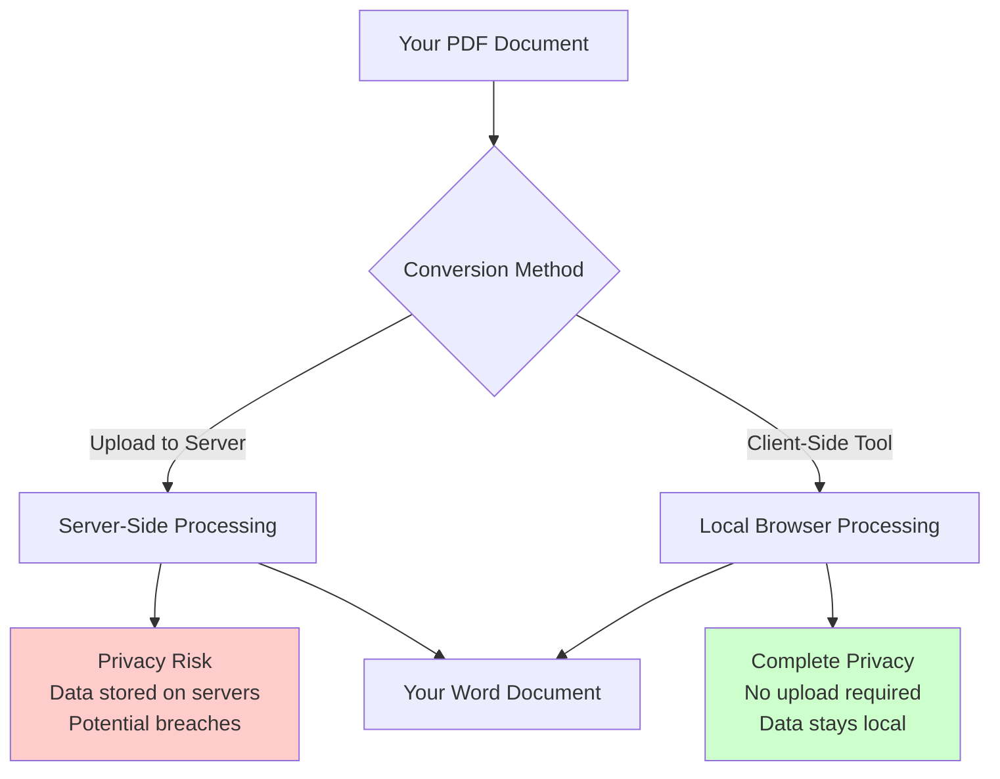
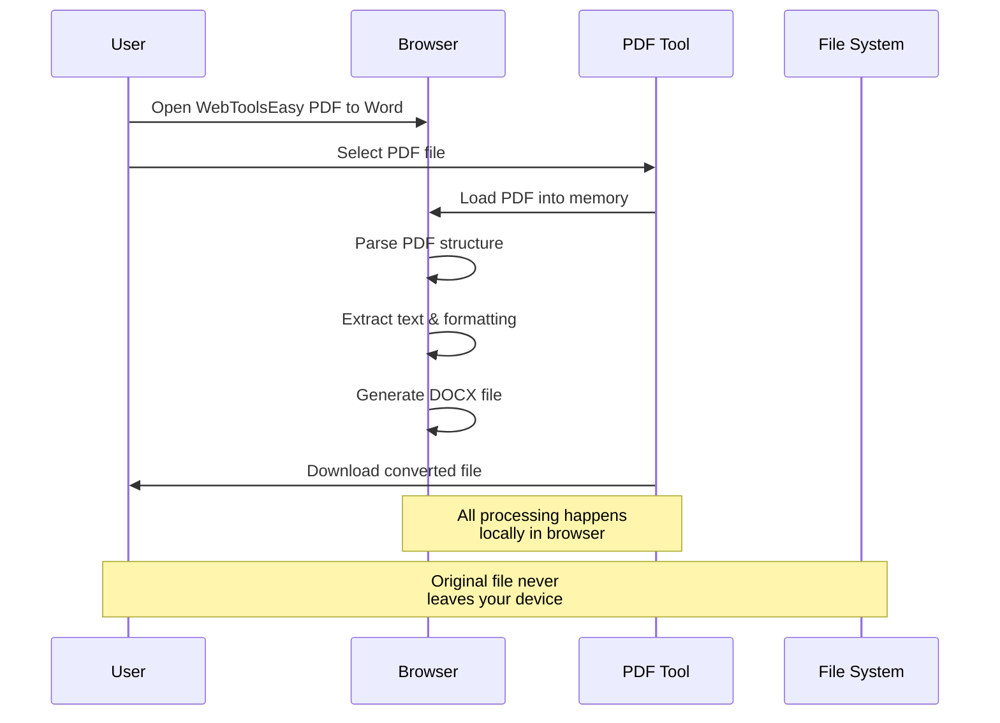
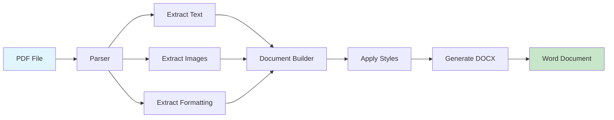

# Convert PDF to Word Without Uploading: Privacy-First Guide 2025

In today's digital age, converting PDF documents to Word format is a common need for professionals, students, and businesses. However, uploading sensitive documents to online converters raises serious privacy concerns. This comprehensive guide will show you how to convert PDF to Word documents while keeping your data completely secure and private.

## Why Privacy Matters in Document Conversion

When you upload a PDF to an online converter, you're essentially trusting a third-party server with potentially sensitive information - contracts, financial documents, medical records, or confidential business plans. Here's what could go wrong:

- **Data Breaches** - Servers can be hacked, exposing your documents to unauthorized access
- **Data Mining** - Some services analyze your documents for marketing purposes
- **Retention Policies** - Your files might be stored longer than advertised
- **Third-Party Access** - Documents could be shared with partners or advertisers
- **Compliance Issues** - Violating GDPR, HIPAA, or other data protection regulations



## Client-Side PDF to Word Conversion: The Privacy Solution

Client-side conversion means all processing happens in your web browser - no files are uploaded to any server. This approach offers:

✅ **Complete Privacy** - Your documents never leave your device  
✅ **Offline Capability** - Works without internet connection  
✅ **No File Size Limits** - Process large documents locally  
✅ **Instant Processing** - No server queue times  
✅ **GDPR Compliant** - No data transmission or storage

## How to Convert PDF to Word Privately Using WebToolsEasy

[WebToolsEasy PDF to Word Converter](https://webtoolseasy.com/tools/pdf-to-word) is a free, client-side tool that converts your PDFs without any server upload.

### Step-by-Step Conversion Process

1. **Open the Tool** - Visit [WebToolsEasy PDF to Word](https://webtoolseasy.com/tools/pdf-to-word)

2. **Select Your PDF** - Click "Choose File" or drag and drop your PDF into the browser

3. **Conversion Happens Locally** - The tool processes your PDF entirely in your browser using WebAssembly technology

4. **Download Your Word Document** - Get your converted DOCX file instantly



### Key Features That Protect Your Privacy

- **No Server Upload** - Files stay on your device
- **No Registration** - No account creation required
- **No Tracking** - We don't collect or store any document data
- **Open Source Libraries** - Uses trusted, auditable conversion libraries
- **Browser-Based** - Works entirely in modern web browsers

## Alternative Privacy-First Methods

### Method 1: Desktop Software

For frequently converting PDFs, consider installing desktop software:

- **LibreOffice Writer** - Free, open-source, works offline
- **Adobe Acrobat DC** - Professional-grade, local processing
- **Microsoft Word** - Built-in PDF import feature

**Pros:**

- Complete offline capability
- No internet dependency
- Enterprise-grade features

**Cons:**

- Requires installation and storage space
- Software licensing costs (for paid options)
- Platform-specific limitations

### Method 2: Programming Libraries (For Developers)

If you need to batch process PDFs, consider using programming libraries:

```python
# Example using Python's pdf2docx library
from pdf2docx import Converter

pdf_file = 'input.pdf'
docx_file = 'output.docx'

cv = Converter(pdf_file)
cv.convert(docx_file)
cv.close()
```

For testing and debugging conversion scripts, use [WebToolsEasy Python Compiler](https://webtoolseasy.com/tools/python-compiler) to run code directly in your browser.

### Method 3: Mobile Apps with Offline Mode

Several mobile apps offer offline PDF conversion:

- **PDF Expert** (iOS)
- **Adobe Scan** (Android/iOS with premium features)
- **WPS Office** (Android/iOS)

## Understanding PDF to Word Conversion Technology



Modern PDF to Word conversion involves several steps:

1. **PDF Parsing** - Analyze the PDF structure and identify content blocks
2. **Text Extraction** - Pull out text content while preserving hierarchy
3. **Image Extraction** - Extract embedded images and graphics
4. **Formatting Recognition** - Identify fonts, sizes, colors, and layouts
5. **Document Reconstruction** - Rebuild the document in Word format
6. **Style Application** - Apply appropriate Word styles and formatting

## Tips for Better Conversion Results

### 1. Check Source PDF Quality

- **Text-based PDFs** convert more accurately than scanned images
- Use [Image to Text OCR](https://webtoolseasy.com/tools/image-to-text) first if your PDF is scanned

### 2. Pre-Process Your PDF

- Reduce file size with [PDF Compress](https://webtoolseasy.com/tools/pdf-compress) if needed
- Split large PDFs using [PDF Split](https://webtoolseasy.com/tools/pdf-split) for better handling

### 3. Post-Conversion Editing

- Open converted file in [Text Editor](https://webtoolseasy.com/tools/text-editor) for quick fixes
- Use [Word Counter](https://webtoolseasy.com/tools/word-counter) to verify content integrity

## Common Use Cases and Solutions

### For Business Professionals

**Scenario:** Converting contracts and agreements for editing

**Solution:** Use client-side converters to maintain confidentiality and comply with NDAs

### For Students and Academics

**Scenario:** Converting research papers and citations

**Solution:** Privacy-first tools ensure academic integrity and prevent plagiarism concerns

### For Healthcare Providers

**Scenario:** Converting patient records and medical documents

**Solution:** HIPAA-compliant, no-upload tools protect patient privacy

### For Legal Professionals

**Scenario:** Converting case files and legal documents

**Solution:** Attorney-client privilege maintained through local processing

## Security Best Practices

When converting sensitive documents:

1. **Verify Tool Authenticity** - Use reputable, open-source tools when possible
2. **Check HTTPS** - Ensure the website uses secure connections
3. **Review Privacy Policy** - Understand how tools handle your data
4. **Use Incognito Mode** - Prevent browser history and cache storage
5. **Clear Browser Cache** - After conversion, clear temporary files
6. **Antivirus Scanning** - Scan converted files before opening

## Comparison: Upload vs. Client-Side Conversion

| Feature               | Server Upload        | Client-Side (WebToolsEasy) |
| --------------------- | -------------------- | -------------------------- |
| **Privacy**           | ⚠️ Files uploaded    | ✅ Complete privacy        |
| **Speed**             | ⏳ Depends on server | ✅ Instant processing      |
| **File Size**         | ⚠️ Usually limited   | ✅ No limits               |
| **Internet Required** | ✅ Yes               | ❌ No (after page load)    |
| **Data Retention**    | ⚠️ May be stored     | ✅ Never stored            |
| **GDPR Compliant**    | ⚠️ Varies            | ✅ Yes                     |
| **Cost**              | ⚠️ Often premium     | ✅ Free                    |

## Additional Privacy-First Tools

Complement your document workflow with other secure tools:

- **[PDF Editor](https://webtoolseasy.com/tools/pdf-editor)** - Edit PDFs without uploading
- **[PDF Merge](https://webtoolseasy.com/tools/pdf-merge)** - Combine PDFs securely
- **[Invoice Generator](https://webtoolseasy.com/tools/invoice-generator)** - Create business documents privately
- **[Resume Builder](https://webtoolseasy.com/tools/resume-builder)** - Build resumes offline
- **[Signature Generator](https://webtoolseasy.com/tools/signature-generator)** - Sign documents digitally

## Troubleshooting Common Issues

### Problem: Formatting Looks Different

**Solution:** PDFs with complex layouts may need manual adjustment. Use [HTML Editor](https://webtoolseasy.com/tools/html-editor) to fine-tune formatting if needed.

### Problem: Images Missing or Distorted

**Solution:** Try [Image Resizer](https://webtoolseasy.com/tools/image-resizer) to optimize images before embedding them back into your document.

### Problem: Large File Won't Convert

**Solution:** Split your PDF using [PDF Split](https://webtoolseasy.com/tools/pdf-split) and convert sections individually.

## Conclusion

Converting PDF to Word documents doesn't have to compromise your privacy. By using client-side tools like [WebToolsEasy's PDF to Word Converter](https://webtoolseasy.com/tools/pdf-to-word), you can maintain complete control over your sensitive documents while enjoying fast, free, and unlimited conversions.

Remember: Your data's privacy is paramount. Choose tools that process documents locally, avoid unnecessary uploads, and always verify that your sensitive information stays secure.

### Quick Action Steps

1. Visit [WebToolsEasy PDF to Word](https://webtoolseasy.com/tools/pdf-to-word)
2. Drag and drop your PDF file
3. Wait for client-side processing
4. Download your Word document
5. Delete the original if no longer needed

Stay secure, stay private, and convert with confidence!
