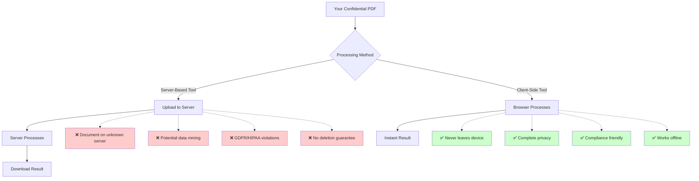
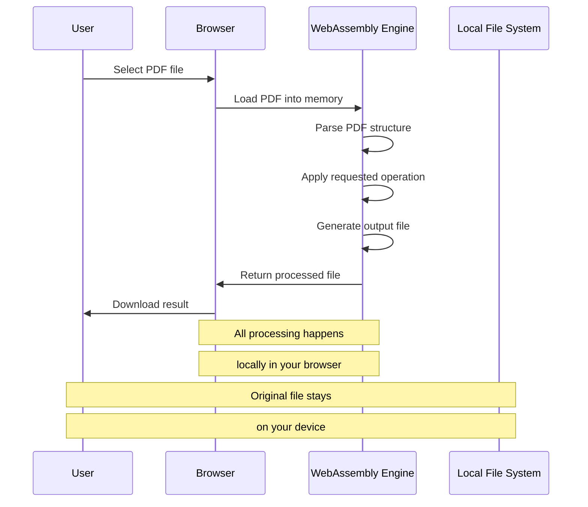
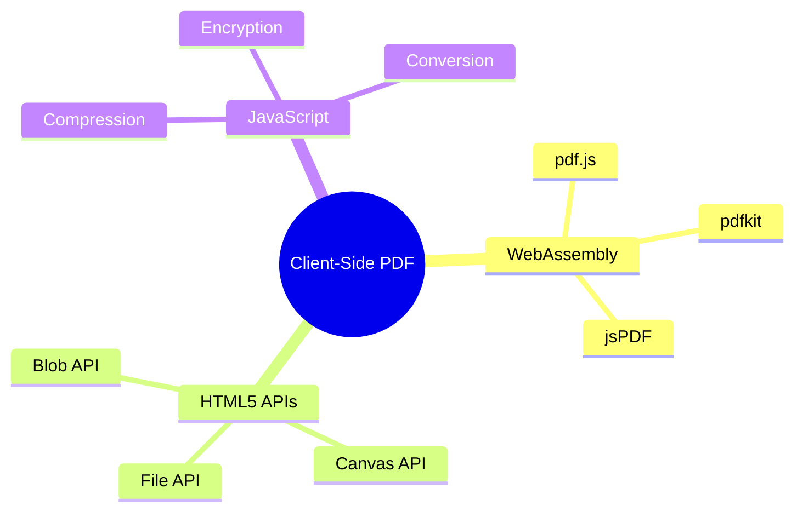
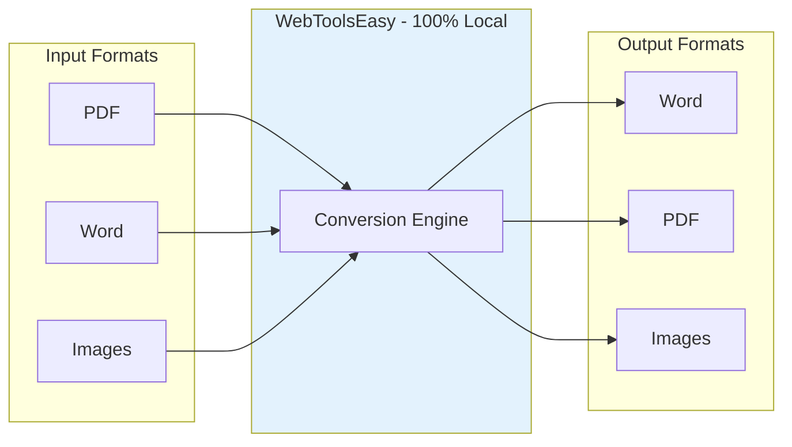
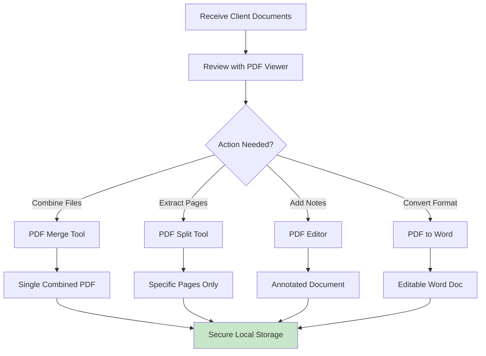
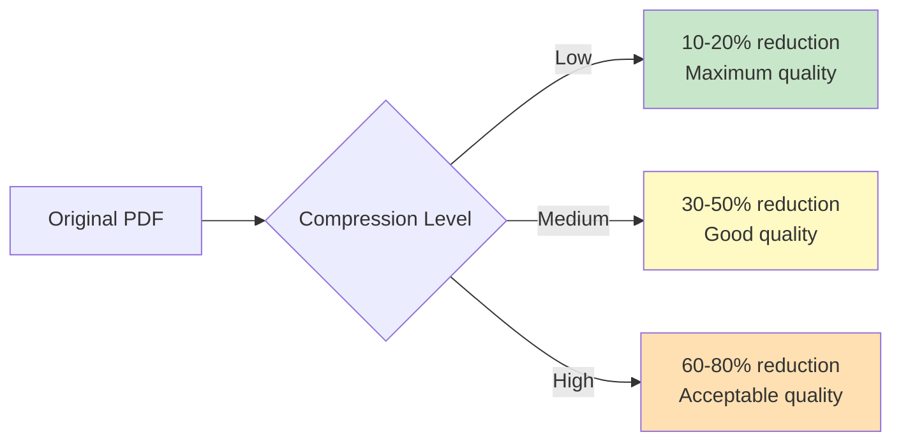
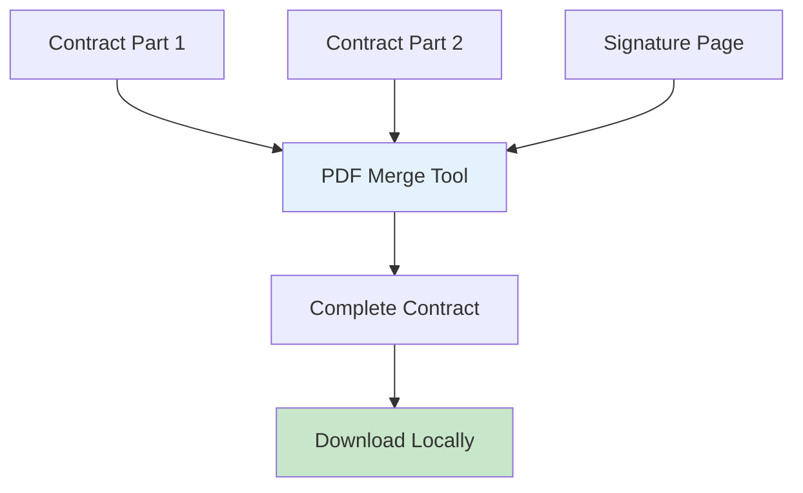
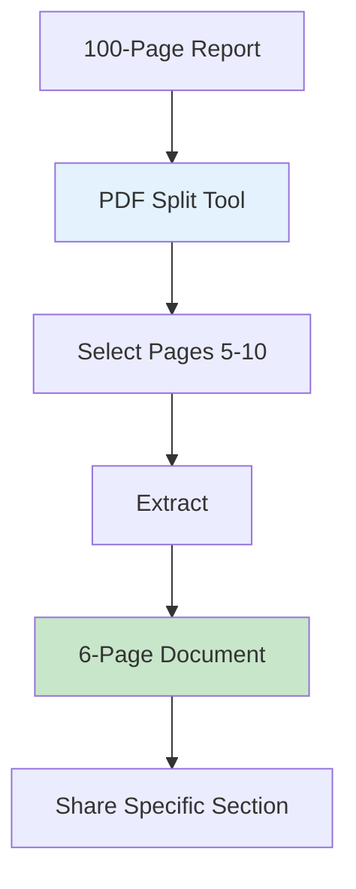
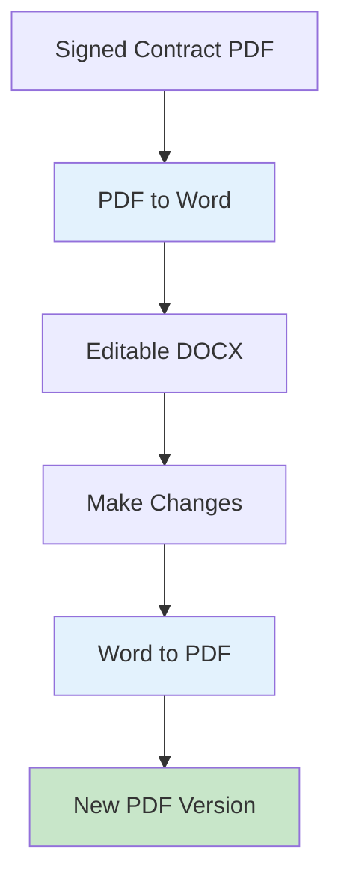
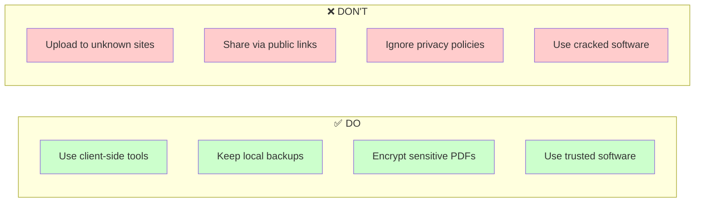

# Privacy-First PDF Tools: Complete Guide to Secure Document Processing

PDF documents often contain the most sensitive information we handle daily: contracts, financial statements, medical records, and legal documents. When you need to edit, merge, or convert these files, where should you do it? This guide explores why client-side PDF tools are essential for protecting your confidential documents.

## The Hidden Risks of Online PDF Tools

Most online PDF tools require you to upload your documents to their servers:

### What's at Stake

| Document Type    | Sensitive Content          | Risk Level  |
| ---------------- | -------------------------- | ----------- |
| **Contracts**    | Terms, signatures, parties | 🔴 High     |
| **Financial**    | Account numbers, balances  | 🔴 High     |
| **Medical**      | Health records, diagnoses  | 🔴 Critical |
| **Legal**        | Case details, evidence     | 🔴 Critical |
| **HR Documents** | SSN, salary, reviews       | 🔴 High     |
| **Tax Returns**  | Income, deductions         | 🔴 High     |

## How Client-Side PDF Processing Works

Modern browsers are incredibly powerful. Using WebAssembly and JavaScript, PDF processing can happen entirely in your browser:

### Technologies That Make It Possible

## Complete PDF Tool Suite - All Client-Side

WebToolsEasy offers a comprehensive suite of privacy-first PDF tools:

### PDF Editing & Management

| Tool                                                        | Function                      | Privacy Benefit        |
| ----------------------------------------------------------- | ----------------------------- | ---------------------- |
| [PDF Editor](https://webtoolseasy.com/tools/pdf-editor)     | Add text, images, annotations | Edit without uploading |
| [PDF Merge](https://webtoolseasy.com/tools/pdf-merge)       | Combine multiple PDFs         | Merge files locally    |
| [PDF Split](https://webtoolseasy.com/tools/pdf-split)       | Extract pages from PDFs       | Split without server   |
| [PDF Compress](https://webtoolseasy.com/tools/pdf-compress) | Reduce file size              | Compress privately     |

### PDF Conversion Tools

| Tool              | Conversion    | Link                                                     |
| ----------------- | ------------- | -------------------------------------------------------- |
| **PDF to Word**   | PDF → DOCX    | [Use Tool](https://webtoolseasy.com/tools/pdf-to-word)   |
| **Word to PDF**   | DOCX → PDF    | [Use Tool](https://webtoolseasy.com/tools/word-to-pdf)   |
| **Images to PDF** | JPG/PNG → PDF | [Use Tool](https://webtoolseasy.com/tools/images-to-pdf) |
| **PDF to Images** | PDF → JPG/PNG | [Use Tool](https://webtoolseasy.com/tools/pdf-to-images) |

## Use Case: Legal Document Workflow

Here's how a law firm might use privacy-first PDF tools:

### Compliance Benefits

✅ **GDPR Compliance** - No data transfer to third parties  
✅ **HIPAA Compliance** - Protected health information stays local  
✅ **SOC 2 Friendly** - No external service dependencies  
✅ **Attorney-Client Privilege** - Documents remain confidential

## PDF Compression: Quality vs Size

When compressing PDFs, you trade file size for quality:

| Compression | Size Reduction | Best For            |
| ----------- | -------------- | ------------------- |
| **Low**     | 10-20%         | Printing, archives  |
| **Medium**  | 30-50%         | Email, sharing      |
| **High**    | 60-80%         | Web upload, storage |

## Common PDF Workflows

### Merging Multiple Documents

### Extracting Specific Pages

### Converting for Editing

## Security Best Practices for PDF Handling

### Do's and Don'ts

### Security Checklist

1. ✅ **Use client-side tools** for all sensitive documents
2. ✅ **Verify the tool works offline** before trusting it
3. ✅ **Check for open-source code** when possible
4. ✅ **Keep local backups** of original documents
5. ✅ **Use password protection** for sensitive PDFs

## Comparison: Server-Based vs Client-Side PDF Tools

| Feature                | WebToolsEasy | Server-Based Tool A | Server-Based Tool B |
| ---------------------- | ------------ | ------------------- | ------------------- |
| Client-Side Processing | ✅ Yes       | ❌ No               | ❌ No               |
| No File Upload         | ✅ Yes       | ❌ No               | ❌ No               |
| Works Offline          | ✅ Yes       | ❌ No               | ❌ No               |
| Free                   | ✅ Yes       | ⚠️ Limited          | ❌ Subscription     |
| No Registration        | ✅ Yes       | ❌ Required         | ❌ Required         |
| File Size Limit        | ✅ None\*    | ⚠️ 10MB             | ⚠️ 25MB             |
| GDPR Compliant         | ✅ Yes       | ⚠️ Varies           | ⚠️ Varies           |

\*Limited only by your device's memory

## Conclusion

Your PDF documents contain some of your most sensitive information. Using server-based tools exposes this data to unnecessary risks.

WebToolsEasy's privacy-first PDF tools provide:

- ✅ Complete local processing
- ✅ No file uploads ever
- ✅ Full feature set: edit, merge, split, compress, convert
- ✅ Works offline for maximum privacy
- ✅ Free with no registration

**Protect your documents. Use client-side PDF tools.**

### Quick Links

- [PDF Editor](https://webtoolseasy.com/tools/pdf-editor) - Edit PDFs privately
- [PDF Merge](https://webtoolseasy.com/tools/pdf-merge) - Combine PDFs locally
- [PDF Split](https://webtoolseasy.com/tools/pdf-split) - Extract pages securely
- [PDF Compress](https://webtoolseasy.com/tools/pdf-compress) - Reduce size offline
- [PDF to Word](https://webtoolseasy.com/tools/pdf-to-word) - Convert privately
