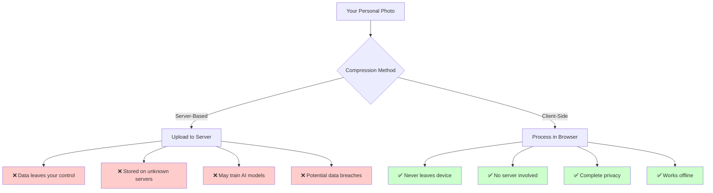
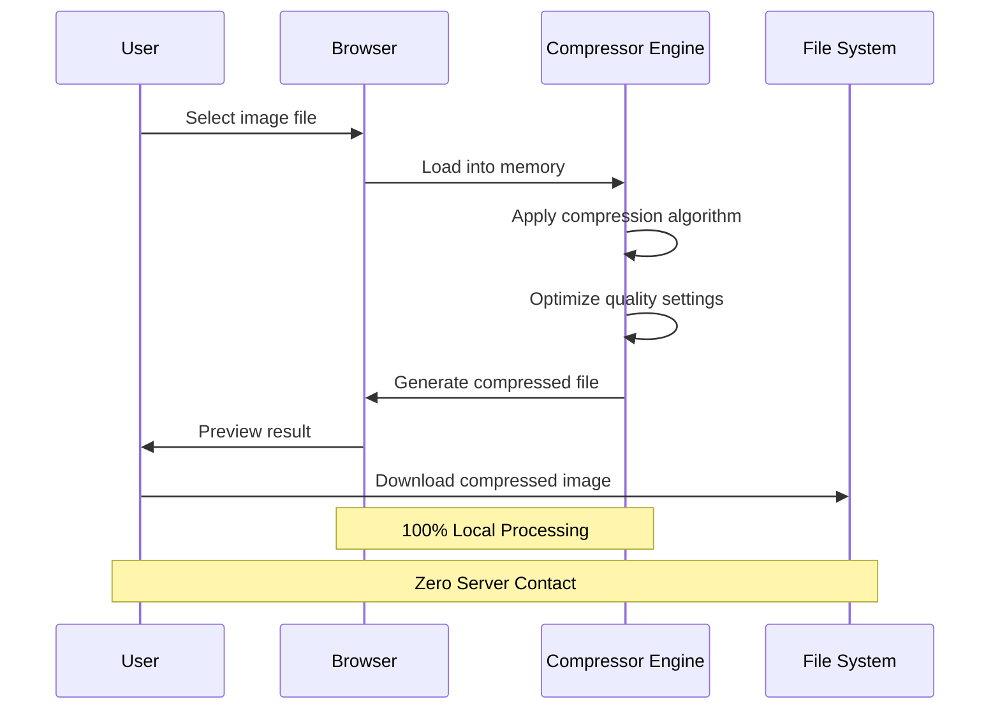
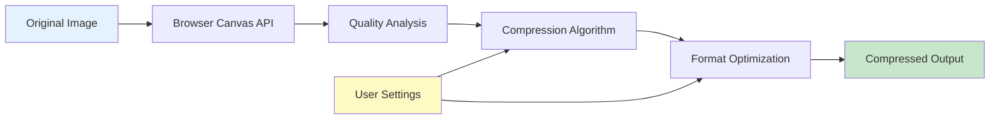
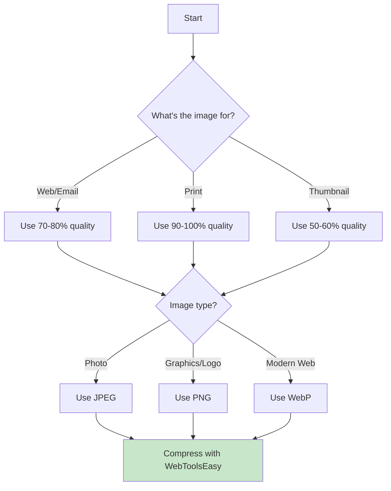

# Private Image Compression: Why Client-Side Tools Are Better

In today's digital world, privacy and data security are paramount concerns. When working with photos and images, many people rely on online image compression tools without realizing the privacy implications. This guide explores why client-side image compression tools are superior to server-based alternatives.

## The Problem with Server-Based Image Compression

When you upload images to a server-based compression tool, you're exposing your personal photos to significant risks:

### Key Risks of Server-Based Compression

| Risk                   | Description                             | Impact                |
| ---------------------- | --------------------------------------- | --------------------- |
| **Data Transmission**  | Photos travel across the internet       | Interception possible |
| **Server Storage**     | Files stored temporarily or permanently | Unknown retention     |
| **AI Training**        | Images may be used for ML models        | Privacy violation     |
| **Data Breaches**      | Servers can be hacked                   | Mass exposure         |
| **Third-Party Access** | Data shared with partners               | Loss of control       |

## The Solution: Client-Side Image Compression

Client-side image compression tools process images directly in your browser with zero server involvement:

### Security Benefits

✅ **Never leaves your device** - Images stay on your computer during compression  
✅ **No servers involved** - No risk of server breaches or data collection  
✅ **Instant processing** - No upload delays or timeouts  
✅ **Works offline** - Compress images without internet connection

### Privacy Advantages

✅ **Complete control** - You decide what happens to your images  
✅ **No terms of service** - You're not bound by another company's policies  
✅ **No data collection** - Tools can't collect, store, or analyze your images  
✅ **Transparent** - You can inspect the tool's source code

## How WebToolsEasy's Image Compressor Works

Our [Image Compressor](https://webtoolseasy.com/tools/image-compress) tool runs 100% in your browser using HTML5 Canvas and modern JavaScript APIs:

### Step-by-Step Process

1. **Load your image** into the browser
2. **Select quality level** (1-100%)
3. **Choose output format** (JPEG, PNG, WebP)
4. **Preview the result** in real-time
5. **Download** the compressed image
6. **Original file untouched** on your device

## Compression Quality Comparison

Understanding quality vs file size tradeoffs:

| Quality   | File Size  | Visual Difference | Recommended For |
| --------- | ---------- | ----------------- | --------------- |
| 90-100%   | Large      | None              | Print, Archives |
| 70-89%    | Medium     | Minimal           | Web, Sharing    |
| 50-69%    | Small      | Noticeable        | Thumbnails      |
| Below 50% | Very Small | Significant       | Previews only   |

## When to Use Client-Side vs Server-Based Tools

### Use Client-Side Tools For:

- 📷 Personal photos and family images
- 🔒 Sensitive documents and screenshots
- 💼 Business and confidential materials
- 📱 Mobile photos with location data
- 🏥 Medical or legal documents

### Server-Based May Be Acceptable For:

- 🌐 Public marketing images
- 📰 Press releases and public content
- 🎨 Stock photos you've purchased

## Related Privacy-First Tools

Extend your privacy-first workflow with these related tools:

| Tool                                                                            | Purpose                          | Privacy Benefit  |
| ------------------------------------------------------------------------------- | -------------------------------- | ---------------- |
| [Image Format Converter](https://webtoolseasy.com/tools/image-format-converter) | Change formats (PNG, JPEG, WebP) | Local conversion |
| [Image Resizer](https://webtoolseasy.com/tools/image-resizer)                   | Resize dimensions                | No upload needed |
| [Crop Image](https://webtoolseasy.com/tools/crop-image)                         | Crop and adjust                  | Browser-based    |
| [Background Remover](https://webtoolseasy.com/tools/background-remover)         | Remove backgrounds               | ML runs locally  |

## Best Practices for Image Compression

### Quick Tips

1. **Start with 80% quality** - Best balance for most images
2. **Use WebP format** - 30% smaller than JPEG with same quality
3. **Batch process** - Compress multiple images at once
4. **Always preview** - Check results before downloading
5. **Keep originals** - Store uncompressed versions separately

## Conclusion

For anyone concerned about privacy, client-side image compression tools are the clear winner. You maintain complete control over your images, avoid potential security breaches, and eliminate the need to trust third-party services.

Try [WebToolsEasy's Image Compressor](https://webtoolseasy.com/tools/image-compress) today - your photos never leave your device, and you get professional-quality compression in seconds.

**Key Takeaways:**

- ✅ Server-based tools expose your images to privacy risks
- ✅ Client-side compression keeps everything local
- ✅ Modern browsers are powerful enough for high-quality compression
- ✅ Use privacy-first tools for all sensitive images
