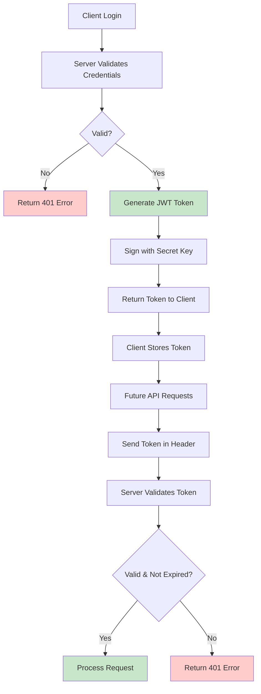
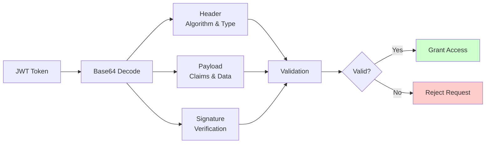
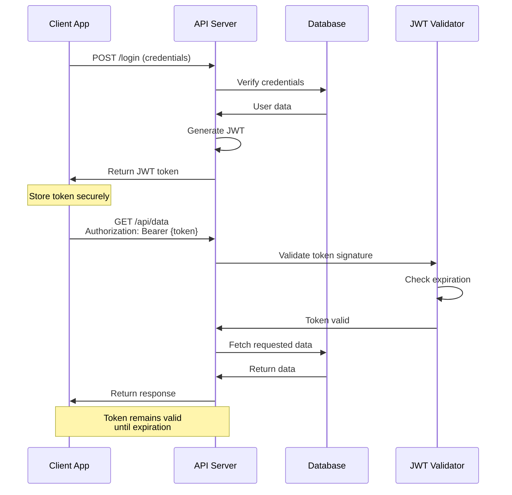
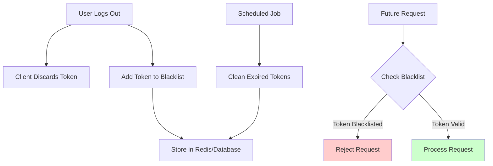
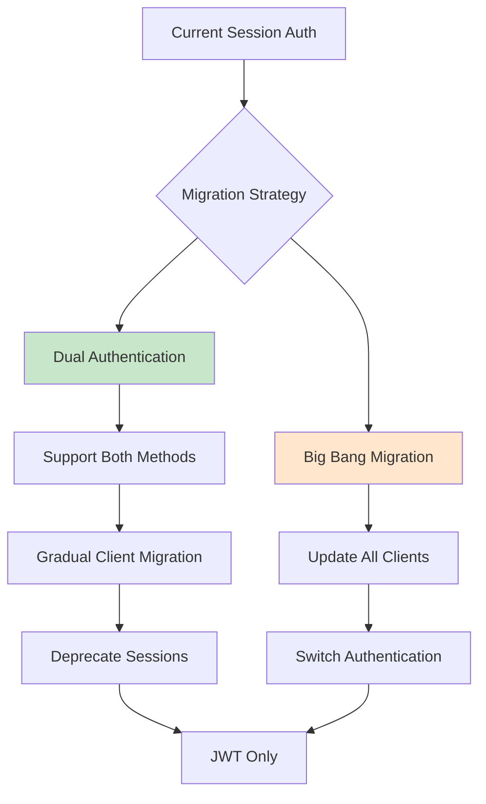

# Building Secure REST APIs with JWT Authentication: Complete 2025 Guide

Building secure REST APIs is crucial for modern web applications. JSON Web Tokens (JWT) have become the de facto standard for API authentication, offering stateless, scalable security. This comprehensive guide will walk you through implementing JWT authentication in your REST APIs, with practical examples and best practices.

## Why JWT Authentication for REST APIs?

Traditional session-based authentication stores user state on the server, which creates challenges for distributed systems and microservices. JWT authentication solves these problems by:

✅ **Stateless Architecture** - No server-side session storage required  
✅ **Scalability** - Works seamlessly across multiple servers  
✅ **Cross-Domain** - Perfect for microservices and SPAs  
✅ **Mobile-Friendly** - Easy to implement in mobile apps  
✅ **Performance** - Reduces database lookups



## Understanding JWT Structure

A JWT consists of three parts separated by dots:

**Header.Payload.Signature**

### JWT Anatomy

1. **Header** - Contains the token type and signing algorithm
2. **Payload** - Contains claims (user data and metadata)
3. **Signature** - Ensures the token hasn't been tampered with

Use [WebToolsEasy JWT Decoder](https://webtoolseasy.com/tools/jwt-decoder) to inspect and validate JWT tokens during development. This client-side tool decodes tokens without sending them to any server, ensuring your sensitive tokens remain private.



## Implementing JWT Authentication: Step-by-Step

### Step 1: Set Up Your Development Environment

First, choose your backend framework. Here are examples for popular languages:

**Node.js (Express)**

```javascript
const express = require("express");
const jwt = require("jsonwebtoken");
const bcrypt = require("bcrypt");

const app = express();
const SECRET_KEY = process.env.JWT_SECRET;
```

**Python (Flask)**

```python
from flask import Flask, request, jsonify
import jwt
import datetime
from werkzeug.security import check_password_hash

app = Flask(__name__)
SECRET_KEY = os.environ.get('JWT_SECRET')
```

Test your JavaScript code snippets using [WebToolsEasy JavaScript Compiler](https://webtoolseasy.com/tools/javascript-compiler) or [Python Compiler](https://webtoolseasy.com/tools/python-compiler) for quick prototyping.

### Step 2: Create the Login Endpoint

```javascript
// Node.js/Express login endpoint
app.post("/api/login", async (req, res) => {
  const { email, password } = req.body;

  // Validate credentials
  const user = await User.findOne({ email });
  if (!user || !(await bcrypt.compare(password, user.passwordHash))) {
    return res.status(401).json({ error: "Invalid credentials" });
  }

  // Generate JWT token
  const token = jwt.sign(
    {
      userId: user.id,
      email: user.email,
      role: user.role,
    },
    SECRET_KEY,
    {
      expiresIn: "24h",
      issuer: "your-api-domain.com",
      audience: "your-app-users",
    }
  );

  res.json({
    token,
    expiresIn: 86400, // 24 hours in seconds
  });
});
```

### Step 3: Create Authentication Middleware

```javascript
// JWT verification middleware
const authenticateToken = (req, res, next) => {
  const authHeader = req.headers["authorization"];
  const token = authHeader && authHeader.split(" ")[1]; // Bearer TOKEN

  if (!token) {
    return res.status(401).json({ error: "Access token required" });
  }

  jwt.verify(token, SECRET_KEY, (err, decoded) => {
    if (err) {
      return res.status(403).json({ error: "Invalid or expired token" });
    }

    req.user = decoded;
    next();
  });
};

// Protected route example
app.get("/api/profile", authenticateToken, (req, res) => {
  res.json({
    userId: req.user.userId,
    email: req.user.email,
  });
});
```

## JWT Authentication Flow



## Security Best Practices

### 1. Use Strong Secret Keys

```javascript
// Generate a secure secret key
const crypto = require("crypto");
const secretKey = crypto.randomBytes(64).toString("hex");
```

Generate secure random strings with [Password Generator](https://webtoolseasy.com/tools/password-generator) for development purposes.

### 2. Set Appropriate Expiration Times

- **Access Tokens** - Short-lived (15 minutes to 1 hour)
- **Refresh Tokens** - Longer-lived (days to weeks)
- **Remember Me** - Extended but with limitations

### 3. Implement Token Refresh Strategy

```javascript
app.post("/api/refresh", authenticateRefreshToken, (req, res) => {
  const newAccessToken = jwt.sign(
    {
      userId: req.user.userId,
      email: req.user.email,
      role: req.user.role,
    },
    SECRET_KEY,
    { expiresIn: "15m" }
  );

  res.json({ accessToken: newAccessToken });
});
```

### 4. Validate Claims Properly

```javascript
const validateToken = (token) => {
  try {
    const decoded = jwt.verify(token, SECRET_KEY, {
      issuer: "your-api-domain.com",
      audience: "your-app-users",
      maxAge: "24h",
    });

    // Additional custom validations
    if (!decoded.userId || !decoded.role) {
      throw new Error("Invalid token claims");
    }

    return decoded;
  } catch (error) {
    throw new Error("Token validation failed");
  }
};
```

## Common JWT Security Vulnerabilities

### 1. Algorithm Confusion Attack

**Problem:** Attacker changes algorithm from RS256 to HS256

**Solution:** Explicitly specify algorithm

```javascript
jwt.verify(token, SECRET_KEY, {
  algorithms: ["HS256"], // Whitelist only expected algorithms
});
```

### 2. Token Leakage

**Problem:** Tokens exposed in URLs or logs

**Solution:**

- Always use Authorization headers
- Never log tokens
- Use HTTPS only

### 3. XSS Attacks

**Problem:** Token stolen via JavaScript injection

**Solution:**

- Store tokens in httpOnly cookies (for web apps)
- Implement Content Security Policy
- Sanitize all user inputs

Test your HTML/JavaScript security with [HTML Editor](https://webtoolseasy.com/tools/html-editor) to ensure proper escaping.

## Advanced JWT Features

### Role-Based Access Control (RBAC)

```javascript
const requireRole = (allowedRoles) => {
  return (req, res, next) => {
    if (!req.user || !allowedRoles.includes(req.user.role)) {
      return res.status(403).json({ error: "Insufficient permissions" });
    }
    next();
  };
};

// Usage
app.delete(
  "/api/users/:id",
  authenticateToken,
  requireRole(["admin"]),
  deleteUser
);
```

### Token Revocation Strategy



```javascript
// Redis-based token blacklist
const redis = require("redis");
const client = redis.createClient();

const blacklistToken = async (token, exp) => {
  const ttl = exp - Math.floor(Date.now() / 1000);
  await client.setex(`blacklist:${token}`, ttl, "true");
};

const isTokenBlacklisted = async (token) => {
  const result = await client.get(`blacklist:${token}`);
  return result === "true";
};
```

## Testing Your JWT Implementation

### 1. Unit Testing

```javascript
const request = require("supertest");
const app = require("./app");

describe("JWT Authentication", () => {
  test("should login successfully with valid credentials", async () => {
    const response = await request(app).post("/api/login").send({
      email: "test@example.com",
      password: "password123",
    });

    expect(response.status).toBe(200);
    expect(response.body).toHaveProperty("token");
  });

  test("should reject invalid token", async () => {
    const response = await request(app)
      .get("/api/profile")
      .set("Authorization", "Bearer invalid-token");

    expect(response.status).toBe(403);
  });
});
```

### 2. Manual Testing with Tools

Use these free tools to streamline your development workflow:

- **[JWT Decoder](https://webtoolseasy.com/tools/jwt-decoder)** - Inspect and validate tokens
- **[JSON Formatter](https://webtoolseasy.com/tools/json-formatter)** - Format API responses
- **[Base64 Encoder/Decoder](https://webtoolseasy.com/tools/base64-encode)** - Work with encoded data
- **[Hash Generator](https://webtoolseasy.com/tools/hash-generator)** - Create secure hashes
- **[UUID Generator](https://webtoolseasy.com/tools/uuid-v4-generator)** - Generate unique IDs

## API Documentation Best Practices

### Document Your Authentication Flow

Create clear API documentation using tools like:

```markdown
## Authentication

### Login

POST /api/login

Request:
{
"email": "user@example.com",
"password": "secure_password"
}

Response:
{
"token": "eyJhbGciOiJIUzI1NiIs...",
"expiresIn": 86400
}

### Using the Token

Include the token in the Authorization header:
Authorization: Bearer {your-token-here}
```

Use [Markdown Editor](https://webtoolseasy.com/tools/markdown-editor) to create and preview your API documentation.

## Performance Optimization

### 1. Token Size Optimization

Keep JWT payloads small:

```javascript
// ❌ Bad - Too much data
const token = jwt.sign(
  {
    userId: user.id,
    email: user.email,
    firstName: user.firstName,
    lastName: user.lastName,
    address: user.address,
    preferences: user.preferences,
  },
  SECRET_KEY
);

// ✅ Good - Minimal data
const token = jwt.sign(
  {
    sub: user.id, // Standard 'subject' claim
    rol: user.role, // Abbreviated claim names
  },
  SECRET_KEY
);
```

### 2. Caching Strategies

```javascript
const NodeCache = require("node-cache");
const userCache = new NodeCache({ stdTTL: 300 }); // 5 minute cache

const getUserData = async (userId) => {
  const cached = userCache.get(userId);
  if (cached) return cached;

  const user = await database.getUserById(userId);
  userCache.set(userId, user);
  return user;
};
```

## Monitoring and Logging

### Security Event Logging

```javascript
const logSecurityEvent = (event, details) => {
  console.log(
    JSON.stringify({
      timestamp: new Date().toISOString(),
      event,
      ...details,
    })
  );
};

// Usage
app.post("/api/login", async (req, res) => {
  const result = await authenticateUser(req.body);

  if (!result.success) {
    logSecurityEvent("LOGIN_FAILED", {
      email: req.body.email,
      ip: req.ip,
      userAgent: req.headers["user-agent"],
    });
  }
});
```

Use [JSON Viewer](https://webtoolseasy.com/tools/json-viewer) to analyze and debug log files.

## Migration from Session to JWT



### Hybrid Approach

```javascript
const authenticate = async (req, res, next) => {
  // Try JWT first
  const token = req.headers["authorization"]?.split(" ")[1];
  if (token) {
    try {
      req.user = jwt.verify(token, SECRET_KEY);
      return next();
    } catch (err) {
      // JWT invalid, try session
    }
  }

  // Fall back to session
  if (req.session?.userId) {
    req.user = await getUserById(req.session.userId);
    return next();
  }

  res.status(401).json({ error: "Authentication required" });
};
```

## Production Checklist

Before deploying your JWT authentication:

- ✅ Use environment variables for secrets
- ✅ Implement rate limiting on auth endpoints
- ✅ Set up HTTPS/TLS
- ✅ Configure CORS properly
- ✅ Implement token rotation
- ✅ Add monitoring and alerting
- ✅ Document security policies
- ✅ Perform security audit
- ✅ Test with various clients
- ✅ Have token revocation strategy

## Helpful Development Tools

Speed up your REST API development with these free tools:

- **[JavaScript Formatter](https://webtoolseasy.com/tools/javascript-formatter)** - Clean up your code
- **[SQL Formatter](https://webtoolseasy.com/tools/sql-formatter)** - Format database queries
- **[Regex Tester](https://webtoolseasy.com/tools/regex-tester)** - Test validation patterns
- **[JSON to YAML](https://webtoolseasy.com/tools/json-to-yaml)** - Convert config files
- **[Text Compare](https://webtoolseasy.com/tools/text-compare)** - Compare API responses
- **[Unix Timestamp Converter](https://webtoolseasy.com/tools/unix-timestamp-converter)** - Work with token expiration times

## Conclusion

JWT authentication provides a robust, scalable solution for REST API security. By following these best practices and using the right tools, you can build secure APIs that protect user data while delivering excellent performance.

### Key Takeaways

1. **Keep tokens short-lived** and implement refresh token rotation
2. **Validate all claims** including issuer, audience, and expiration
3. **Use strong cryptographic algorithms** (HS256 or RS256)
4. **Never expose tokens** in URLs or client-side storage without protection
5. **Monitor and log** authentication events for security analysis
6. **Test thoroughly** with tools like [JWT Decoder](https://webtoolseasy.com/tools/jwt-decoder)

Start building your secure REST API today, and remember - security is not a feature, it's a foundation!

### Additional Resources

- Explore [WebToolsEasy Developer Tools](https://webtoolseasy.com)
- Read our [JWT Decoding Guide](https://webtoolseasy.com/blog/decoding-jwt-comprehensive-guide)
- Test your implementation with client-side tools

Happy coding! 🚀
