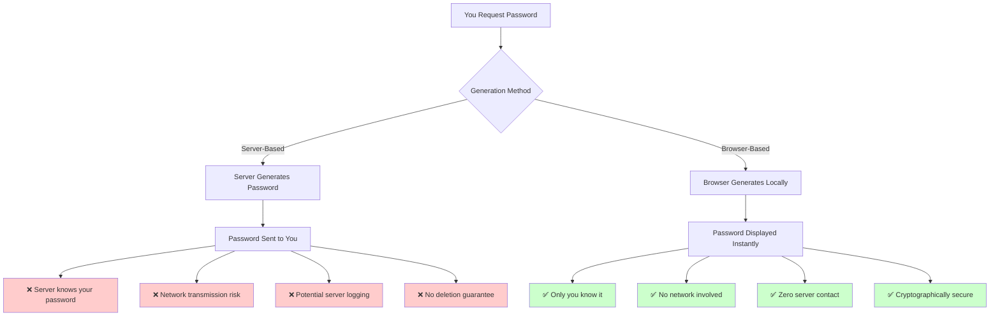
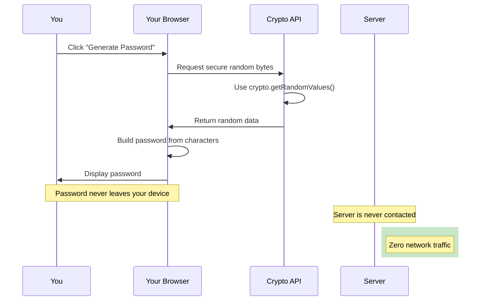
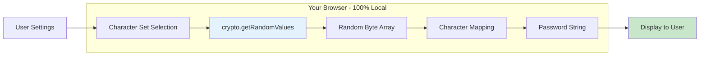
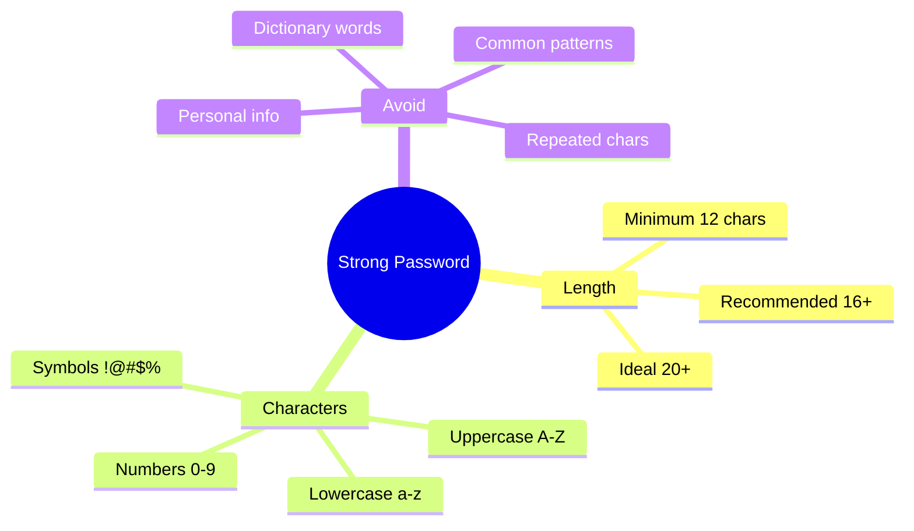
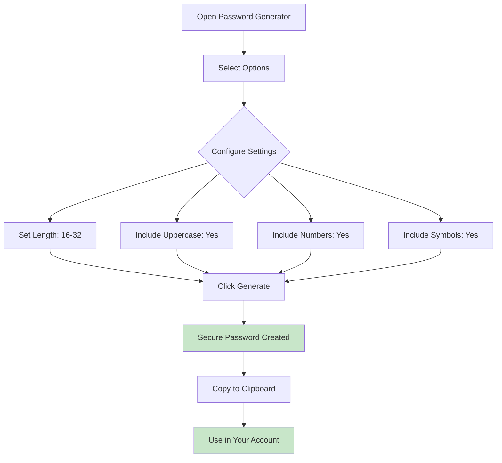
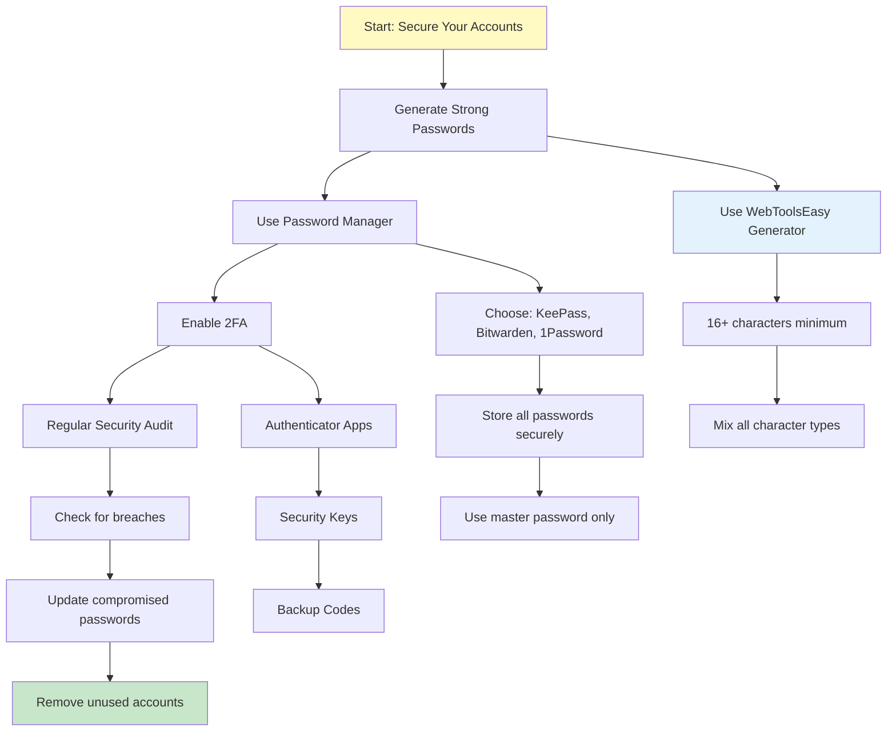

# Secure Password Generation: Why Browser-Based Tools Are Best

Password security is the first line of defense against account compromise. Yet many people rely on server-based password generators, unknowingly putting their security at risk. This guide explains why generating passwords locally in your browser is the most secure approach.

## The Hidden Risk of Server-Based Password Generators

When you generate a password on a server-based tool, you're trusting that server with your most critical security credential:



### Why This Matters

| Server-Based Risk     | Potential Consequence                         |
| --------------------- | --------------------------------------------- |
| Server knows password | Mass breach exposes all generated passwords   |
| Network transmission  | Man-in-the-middle attack captures password    |
| Server logging        | Passwords stored in log files indefinitely    |
| Third-party access    | Employees or hackers access password database |

## Why Client-Side Password Generation is Superior

Browser-based password generators have no way to access your passwords:



### Security Advantages

✅ **No server involvement** - Passwords generated on your device only  
✅ **No transmission** - Generated password never travels across the internet  
✅ **No logging** - No server can log or store your passwords  
✅ **Immediate control** - You decide what happens to the password  
✅ **No third-party trust** - Not dependent on a company's security practices

### Technical Advantages

✅ **Cryptographically random** - Uses browser's secure random number generation  
✅ **Offline operation** - Works without internet connection  
✅ **Instant generation** - No server delays  
✅ **Auditable** - You can inspect the source code

## How Client-Side Password Generators Work

Your browser generates passwords locally using the Web Cryptography API:



### The Crypto.getRandomValues() API

Modern browsers provide cryptographically secure random number generation:

```javascript
// This is what runs in your browser
const array = new Uint8Array(32);
window.crypto.getRandomValues(array);
// 'array' now contains 32 cryptographically random bytes
```

No external server is contacted. The random data comes from your operating system's secure random number generator.

## Strong Password Requirements

A secure password should meet these criteria:



### Password Strength Comparison

| Password Type   | Example                 | Crack Time             | Security Level |
| --------------- | ----------------------- | ---------------------- | -------------- |
| 6 lowercase     | `hello1`                | Instant                | ❌ Weak        |
| 8 mixed case    | `Hello123`              | Minutes                | ❌ Weak        |
| 12 with symbols | `H3ll0!W0rld#`          | Years                  | ⚠️ Medium      |
| 16 random       | `K#9xL!mP2@qW8$nR`      | Millennia              | ✅ Strong      |
| 20+ random      | `Xk#9L!mP2@qW8$nRt%4Ys` | Heat death of universe | ✅ Very Strong |

## Using WebToolsEasy Password Generator

Our [Password Generator](https://webtoolseasy.com/tools/password-generator) creates cryptographically secure passwords entirely in your browser:



### Key Features

| Feature                 | Benefit                                        |
| ----------------------- | ---------------------------------------------- |
| **100% Client-Side**    | Password never leaves your browser             |
| **Customizable Length** | Generate 8 to 128+ characters                  |
| **Character Options**   | Control uppercase, lowercase, numbers, symbols |
| **Exclude Similar**     | Avoid confusing characters (0/O, 1/l/I)        |
| **Instant Generation**  | No waiting for server response                 |
| **Copy to Clipboard**   | One-click secure copying                       |

## Creating Your Password Security Strategy

### Complete Password Security Flowchart



### Step 1: Use a Password Generator (Client-Side)

Generate strong, random passwords using local tools. Never reuse passwords across accounts.

### Step 2: Use a Password Manager

Store generated passwords securely:

| Password Manager | Type                | Best For          |
| ---------------- | ------------------- | ----------------- |
| **KeePass**      | Local               | Maximum privacy   |
| **Bitwarden**    | Cloud (Open Source) | Cross-device sync |
| **1Password**    | Commercial          | Families & Teams  |

### Step 3: Enable Two-Factor Authentication

Add extra security layers:

| 2FA Method             | Security Level | Recommended |
| ---------------------- | -------------- | ----------- |
| Authenticator App      | ✅ High        | Yes         |
| Security Key (YubiKey) | ✅ Very High   | Yes         |
| SMS Codes              | ⚠️ Medium      | Last resort |
| Email Codes            | ⚠️ Medium      | Last resort |

### Step 4: Regular Security Audits

Periodically review and update:

- Check [Have I Been Pwned](https://haveibeenpwned.com/) for breaches
- Update passwords for compromised accounts
- Remove access for unused services

## Password Generation Best Practices

### What to Do

✅ Generate long, random passwords (16+ characters)  
✅ Use different passwords for every account  
✅ Store passwords in a password manager  
✅ Enable 2FA on all important accounts  
✅ Use client-side generators for privacy

### What to Avoid

❌ Reusing passwords across sites  
❌ Using personal information in passwords  
❌ Trusting server-based generators  
❌ Storing passwords in plain text  
❌ Sharing passwords via email/chat

## Related Security Tools

Complete your security toolkit with these privacy-first tools:

| Tool                   | Purpose                   | Link                                                          |
| ---------------------- | ------------------------- | ------------------------------------------------------------- |
| **Password Generator** | Create secure passwords   | [Use Tool](https://webtoolseasy.com/tools/password-generator) |
| **Hash Generator**     | Generate secure hashes    | [Use Tool](https://webtoolseasy.com/tools/hash-generator)     |
| **UUID Generator**     | Create unique identifiers | [Use Tool](https://webtoolseasy.com/tools/uuid-v4-generator)  |
| **Base64 Encode**      | Encode sensitive data     | [Use Tool](https://webtoolseasy.com/tools/base64-encode)      |

## Conclusion

Password security starts with how you generate your passwords. Server-based generators introduce unnecessary risk - your passwords are transmitted, potentially logged, and stored on systems you don't control.

Use [WebToolsEasy's Password Generator](https://webtoolseasy.com/tools/password-generator) for:

- ✅ 100% client-side password generation
- ✅ Cryptographically secure randomness
- ✅ Complete privacy - no server contact
- ✅ Customizable strength settings

**Generate passwords the right way: locally, securely, and privately.**

---

**Key Takeaways:**

- 🔐 Server-based generators create unnecessary security risks
- 🔐 Browser-based generation uses cryptographic APIs
- 🔐 Always use 16+ character random passwords
- 🔐 Combine with a password manager and 2FA
- 🔐 Regularly audit your password security
