# Text & Writing Tools: Word Counter, Case Converter & Productivity Boosters

Whether you're a content writer, student, or professional, working with text is a daily activity. From counting words to formatting text, these tasks are essential. This guide covers the best free, privacy-first text tools that work entirely in your browser.

## Why Use Browser-Based Text Tools?

Your text often contains sensitive information:

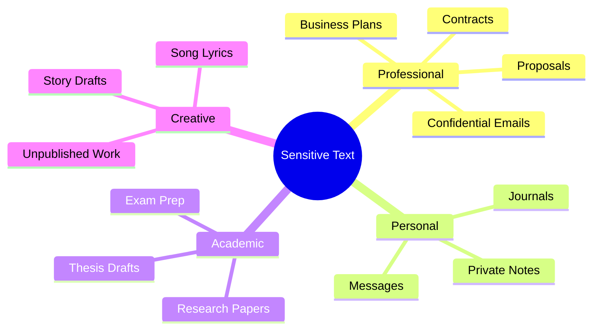

Using server-based tools means sending this content to unknown servers.

## Essential Text Tools

### Word Counter

Count words, characters, sentences, and more:

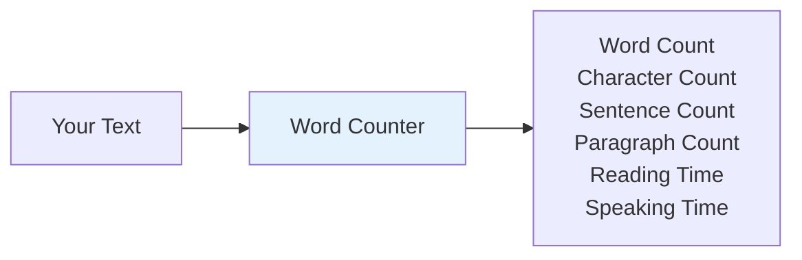

**Key Metrics Provided:**

| Metric                     | Use Case                              |
| -------------------------- | ------------------------------------- |
| **Words**                  | Essay requirements, article length    |
| **Characters**             | Twitter/SMS limits, meta descriptions |
| **Characters (no spaces)** | SEO titles, URL slugs                 |
| **Sentences**              | Readability analysis                  |
| **Paragraphs**             | Document structure                    |
| **Reading Time**           | Blog post planning                    |
| **Speaking Time**          | Presentation prep                     |

[Use Word Counter →](https://webtoolseasy.com/tools/word-counter)

### Case Converter

Convert text between different cases:

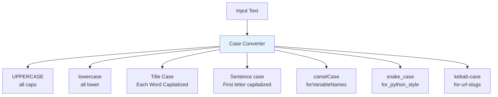

**Common Use Cases:**

| Case Type         | Best For              |
| ----------------- | --------------------- |
| **UPPERCASE**     | Headlines, emphasis   |
| **lowercase**     | URLs, usernames       |
| **Title Case**    | Book titles, headings |
| **Sentence case** | Normal text           |
| **camelCase**     | JavaScript variables  |
| **snake_case**    | Python, databases     |
| **kebab-case**    | URLs, CSS classes     |

[Use Case Converter →](https://webtoolseasy.com/tools/case-converter)

### Text Compare

Compare two texts and find differences:

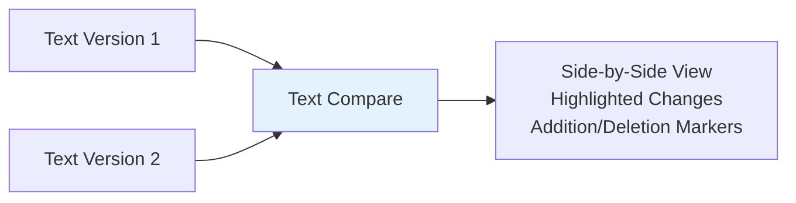

**Use Cases:**

- ✅ Compare document versions
- ✅ Review code changes
- ✅ Check for plagiarism
- ✅ Verify translations

[Use Text Compare →](https://webtoolseasy.com/tools/text-compare)

### Diff Checker

Detailed difference analysis for code and text:

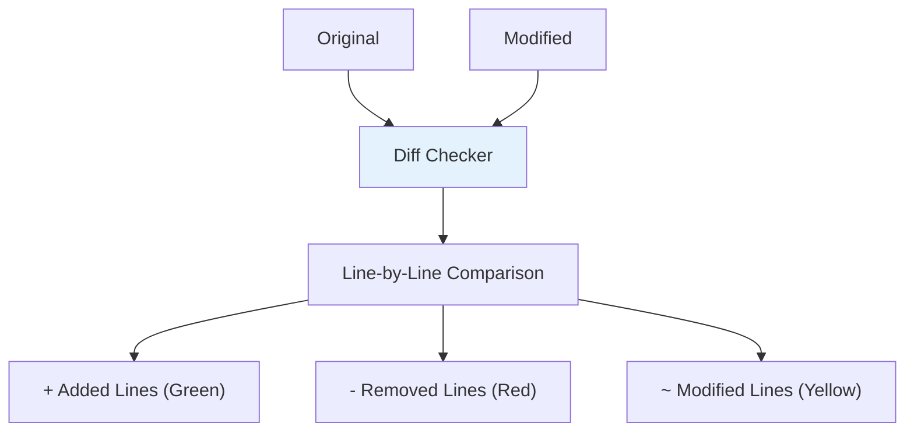

[Use Diff Checker →](https://webtoolseasy.com/tools/diff-checker)

### Lorem Ipsum Generator

Generate placeholder text:

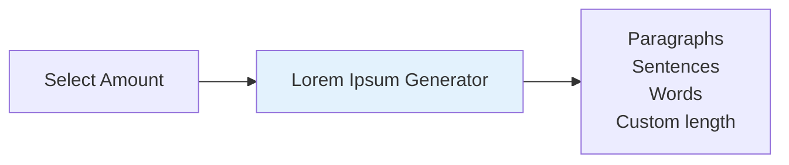

**Options:**

- Generate paragraphs (1-100)
- Generate sentences
- Generate specific word count
- Classic Latin or modern text

[Use Lorem Ipsum Generator →](https://webtoolseasy.com/tools/lorem-ipsum-generator)

## Advanced Text Tools

### Text Summarizer

Summarize long text automatically:

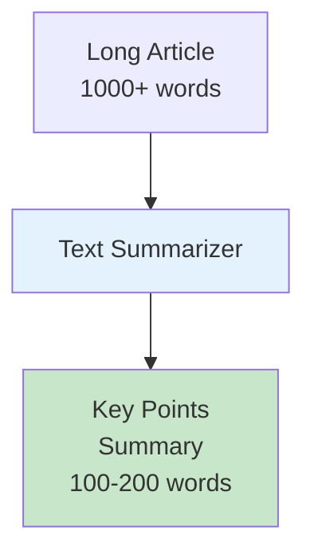

[Use Text Summarizer →](https://webtoolseasy.com/tools/text-summarizer)

### Paraphrasing Tool

Rewrite text in different words:

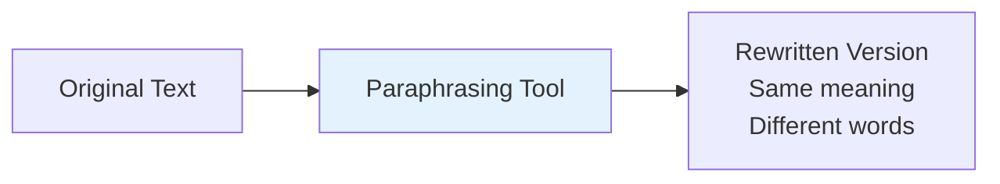

[Use Paraphrasing Tool →](https://webtoolseasy.com/tools/paraphrasing-tool)

### ASCII Art Generator

Convert text to ASCII art:

```
 _   _      _ _        __        __         _     _
| | | | ___| | | ___   \ \      / /__  _ __| | __| |
| |_| |/ _ \ | |/ _ \   \ \ /\ / / _ \| '__| |/ _` |
|  _  |  __/ | | (_) |   \ V  V / (_) | |  | | (_| |
|_| |_|\___|_|_|\___/     \_/\_/ \___/|_|  |_|\__,_|
```

[Use ASCII Art Generator →](https://webtoolseasy.com/tools/ascii-art-generator)

## Writing & Editing Tools

### Markdown Editor

Write and preview Markdown:

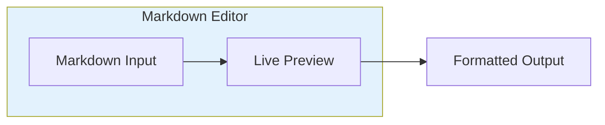

**Features:**

- ✅ Split-pane editing
- ✅ Live preview
- ✅ Syntax highlighting
- ✅ Export to HTML

[Use Markdown Editor →](https://webtoolseasy.com/tools/markdown-editor)

### HTML to Markdown

Convert HTML to Markdown format:

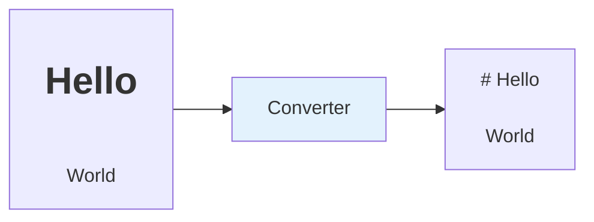

[Use HTML to Markdown →](https://webtoolseasy.com/tools/html-to-markdown)

### Markdown to HTML

Convert Markdown to HTML:

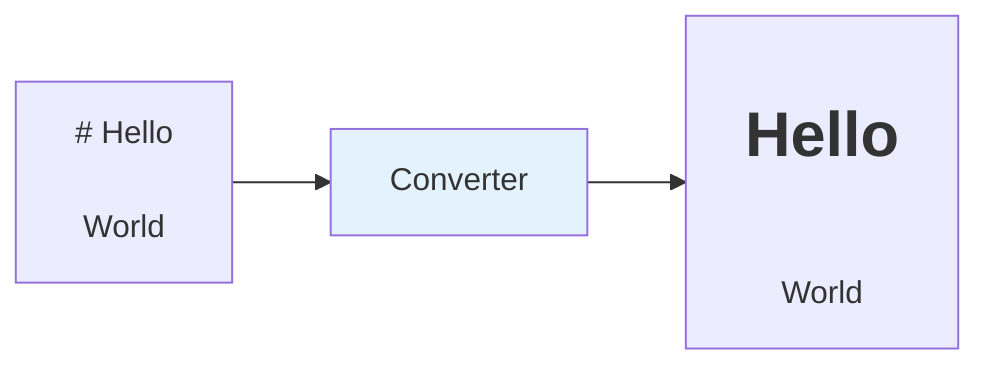

[Use Markdown to HTML →](https://webtoolseasy.com/tools/markdown-to-html-converter)

## Voice & Audio Text Tools

### Speech to Text

Convert spoken words to text:

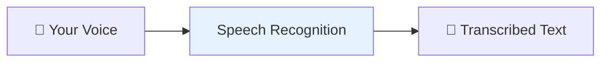

**Uses:**

- ✅ Meeting transcription
- ✅ Voice notes
- ✅ Accessibility
- ✅ Hands-free typing

[Use Speech to Text →](https://webtoolseasy.com/tools/speech-to-text)

### Text to Speech

Convert text to audio:

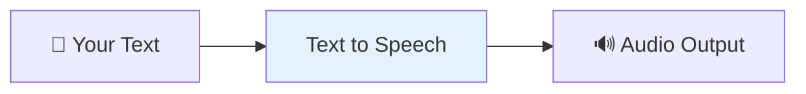

**Uses:**

- ✅ Proofreading by listening
- ✅ Accessibility
- ✅ Language learning
- ✅ Audio content creation

[Use Text to Speech →](https://webtoolseasy.com/tools/text-to-speech)

## Text Encoding Tools

### String Escape/Unescape

Handle escape sequences:

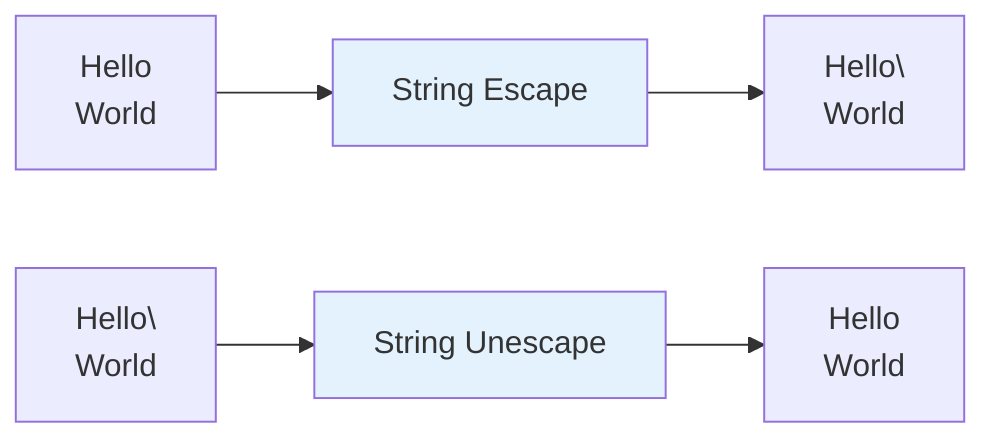

[Use String Escape →](https://webtoolseasy.com/tools/string-escape)

### HTML Entities

Encode/decode HTML entities:

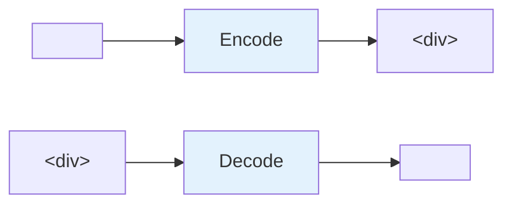

[Use HTML Entities →](https://webtoolseasy.com/tools/html-entities-encoder-decoder)

## Writing Workflow Examples

### Blog Post Preparation

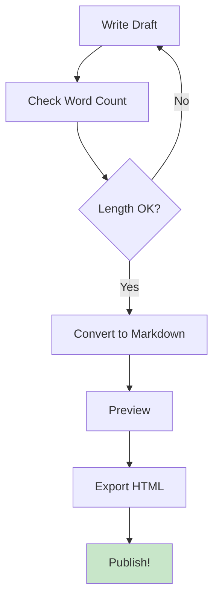

### Academic Writing

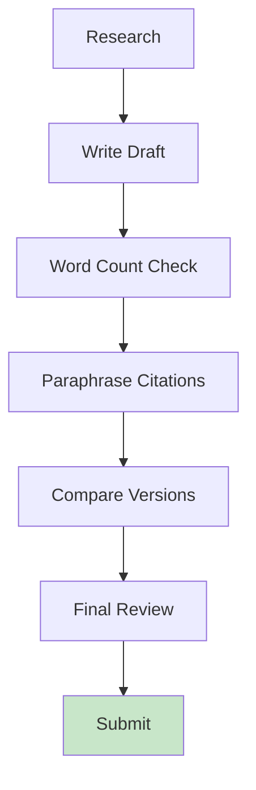

### Content Editing

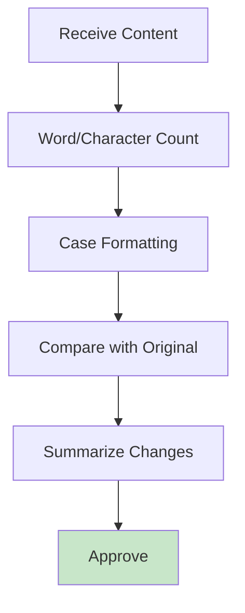

## Complete Text Tools Reference

| Tool                | Purpose                  | Link                                                             |
| ------------------- | ------------------------ | ---------------------------------------------------------------- |
| **Word Counter**    | Count words, chars, time | [Use Tool](https://webtoolseasy.com/tools/word-counter)          |
| **Case Converter**  | Change text case         | [Use Tool](https://webtoolseasy.com/tools/case-converter)        |
| **Text Compare**    | Compare two texts        | [Use Tool](https://webtoolseasy.com/tools/text-compare)          |
| **Diff Checker**    | Detailed diff analysis   | [Use Tool](https://webtoolseasy.com/tools/diff-checker)          |
| **Lorem Ipsum**     | Generate placeholder     | [Use Tool](https://webtoolseasy.com/tools/lorem-ipsum-generator) |
| **Text Summarizer** | Summarize content        | [Use Tool](https://webtoolseasy.com/tools/text-summarizer)       |
| **Paraphrasing**    | Rewrite text             | [Use Tool](https://webtoolseasy.com/tools/paraphrasing-tool)     |
| **ASCII Art**       | Text to ASCII            | [Use Tool](https://webtoolseasy.com/tools/ascii-art-generator)   |
| **Markdown Editor** | Write Markdown           | [Use Tool](https://webtoolseasy.com/tools/markdown-editor)       |
| **Speech to Text**  | Voice transcription      | [Use Tool](https://webtoolseasy.com/tools/speech-to-text)        |
| **Text to Speech**  | Read text aloud          | [Use Tool](https://webtoolseasy.com/tools/text-to-speech)        |

## Conclusion

Quality writing tools shouldn't cost money or compromise your privacy. WebToolsEasy provides a complete suite of text and writing tools that:

- ✅ Work 100% in your browser
- ✅ Never upload your content
- ✅ Are completely free
- ✅ Work offline
- ✅ Cover all writing needs

**Your words, your privacy, your control.**

---

### Quick Access

**Essential:** [Word Counter](https://webtoolseasy.com/tools/word-counter) | [Case Converter](https://webtoolseasy.com/tools/case-converter) | [Lorem Ipsum](https://webtoolseasy.com/tools/lorem-ipsum-generator)

**Compare:** [Text Compare](https://webtoolseasy.com/tools/text-compare) | [Diff Checker](https://webtoolseasy.com/tools/diff-checker)

**Markdown:** [Markdown Editor](https://webtoolseasy.com/tools/markdown-editor) | [MD to HTML](https://webtoolseasy.com/tools/markdown-to-html-converter) | [HTML to MD](https://webtoolseasy.com/tools/html-to-markdown)

**Voice:** [Speech to Text](https://webtoolseasy.com/tools/speech-to-text) | [Text to Speech](https://webtoolseasy.com/tools/text-to-speech)
